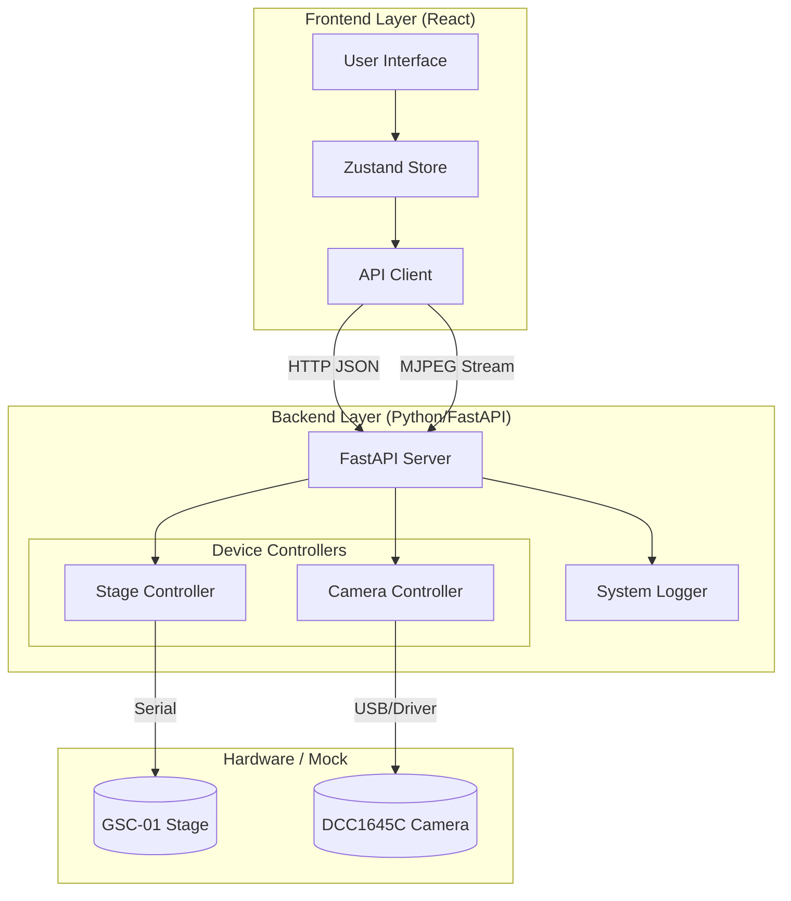

# 00. 全体アーキテクチャ (Architecture Overview)

本プロジェクト「NanoPol Controller」の技術構造、ディレクトリ構成、およびドキュメント体系について解説します。

## 1. システム全体図

本システムは、Tauriをアプリケーションシェルとして使用していますが、実態は **「React (Frontend) と Python (Backend) が HTTP で通信するクライアント・サーバー構成」** です。



## 2. ディレクトリ構成

主要なディレクトリとその役割は以下の通りです。

```text
/
├── backend/            # Pythonバックエンド (FastAPI)
│   ├── devices/        # ハードウェア制御モジュール (Stage, Camera)
│   ├── logs/           # システムログ保存先
│   ├── utils/          # ロガー等のユーティリティ
│   └── main.py         # サーバーエントリーポイント
│
├── src/                # Reactフロントエンド
│   ├── api/            # APIクライアント (fetch wrapper)
│   ├── components/     # UIコンポーネント (views, shared, ui)
│   ├── store/          # Zustandストア (状態管理)
│   └── types/          # TypeScript型定義
│
├── src-tauri/          # Tauri設定 (Rust)
│   # 基本的にシェル機能のみ。アプリロジックはここにはない。
│
├── spec/               # 仕様書 (要件定義、UIフロー)
│   # 「何を作るか」が書かれている場所。
│
└── docs/               # 技術ドキュメント (実装詳細)
    # 「どう作ったか」が書かれている場所。
```

## 3. ドキュメントインデックス

詳細な実装解説は、以下のレイヤー別ドキュメントを参照してください。

| ドキュメント                                        | 内容                                               | 対象ファイル        |
| :-------------------------------------------------- | :------------------------------------------------- | :------------------ |
| **[01. ハードウェア制御層](01_backend_devices.md)** | ステージ/カメラの制御ロジック、Mock機能、Pitch処理 | `backend/devices/*` |
| **[02. APIサーバー層](02_backend_server.md)**       | FastAPI実装、ライフサイクル、ロギング設計          | `backend/main.py`   |
| **[03. フロントエンド層](03_frontend_client.md)**   | React/Zustand実装、ポーリング、非同期UI設計        | `src/*`             |

## 4. 開発環境のセットアップ

### Backend (Python)
```bash
cd backend
# 仮想環境の作成と有効化 (uv推奨)
uv venv
source .venv/bin/activate
# 依存関係インストール
uv pip install -r pyproject.toml
# サーバー起動 (Dev)
python main.py
```

### Frontend (Node.js)
```bash
# 依存関係インストール
pnpm install
# 開発サーバー起動
pnpm tauri dev
```

---

## 6. 開発者向けガイド: アーキテクチャとは？

このセクションでは、プログラミング学習者向けに、「アーキテクチャ」という言葉の意味と、このプロジェクトの構造について解説します。

### アーキテクチャ (Architecture)
直訳すると「建築様式」や「構造」ですが、ソフトウェア開発においては **「プログラム全体の設計思想や、部品ごとの役割分担」** を指します。
良いアーキテクチャは、「どこに何が書いてあるか」が直感的にわかり、機能の追加や修正がしやすくなっています。

### 本プロジェクトの構造: クライアント・サーバーモデル
このアプリは1つのデスクトップアプリに見えますが、内部では2つの異なるプログラムが動いています。

1.  **フロントエンド (クライアント):**
    *   画面の見た目やボタン操作を担当します。
    *   **React (JavaScript/TypeScript)** で書かれています。
    *   レストランで言うところの「ホールスタッフ（注文を聞く人）」です。
2.  **バックエンド (サーバー):**
    *   ハードウェア（カメラやステージ）を実際に動かします。
    *   **Python** で書かれています。
    *   レストランで言うところの「厨房スタッフ（料理を作る人）」です。

### なぜ分けるのか？
*   **役割の分離:** デザインの変更（React）と、機械制御の変更（Python）を別々に作業できるため、開発がスムーズになります。
*   **安全性:** UIがフリーズしても、バックエンドで安全装置（緊急停止など）を動かし続けることができます。
*   **得意分野:** UIを作るのはJavaScriptが得意ですが、ハードウェア制御や科学計算はPythonが得意です。それぞれの「得意」を活かす構成です。