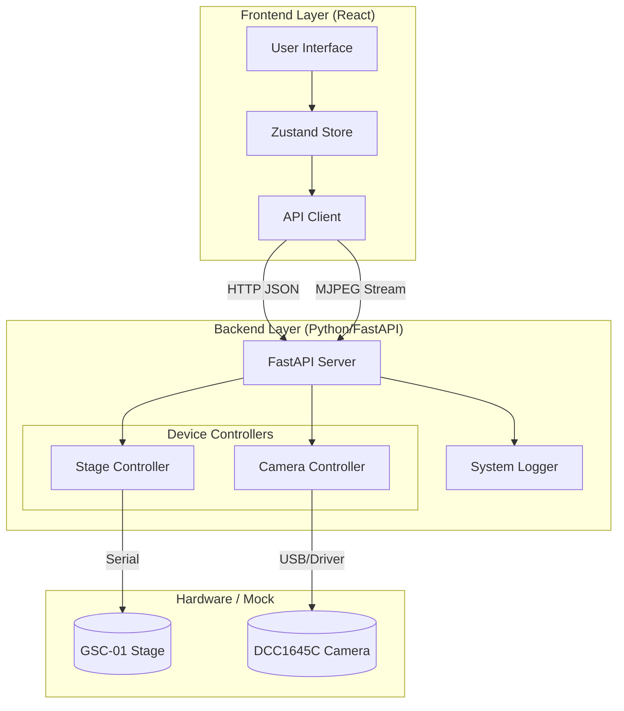

# 00. 全体アーキテクチャ (Architecture Overview)

本プロジェクト「NanoPol Controller」の技術構造、ディレクトリ構成、およびドキュメント体系について解説します。

## 1. システム全体図

本システムは、Tauriをアプリケーションシェルとして使用していますが、実態は **「React (Frontend) と Python (Backend) が HTTP で通信するクライアント・サーバー構成」** です。
Tauri (Rust) はその間でバックエンド起動とポート受け渡しを調停し、接続先の確定後に React 側へ通信を引き継ぎます。



## 2. ディレクトリ構成

主要なディレクトリとその役割は以下の通りです。

```text
/
├── backend/            # Pythonバックエンド (FastAPI)
│   ├── devices/        # ハードウェア制御モジュール (Stage, Camera)
│   ├── logs/           # システムログ保存先
│   ├── utils/          # ロガー等のユーティリティ
│   └── main.py         # サーバーエントリーポイント
│   ├── build_exe.py    # バックエンド実行ファイル(exe)作成用ビルドスクリプト
│
├── src/                # Reactフロントエンド
│   ├── api/            # APIクライアント (fetch wrapper)
│   ├── components/     # UIコンポーネント (views, shared, ui)
│   ├── store/          # Zustandストア (状態管理)
│   └── types/          # TypeScript型定義
│
├── src-tauri/          # Tauri設定 (Rust)
│   # 基本的にシェル機能のみ。アプリロジックはここにはない。
│
├── spec/               # 仕様書 (要件定義、UIフロー)
│   # 「何を作るか」が書かれている場所。
│
└── docs/               # 技術ドキュメント (実装詳細)
    # 「どう作ったか」が書かれている場所。
```

## 3. ドキュメントインデックス

詳細な実装解説は、以下のレイヤー別ドキュメントを参照してください。

| ドキュメント                                                              | 内容                                               | 対象ファイル                   |
| :------------------------------------------------------------------------ | :------------------------------------------------- | :----------------------------- |
| **[01. ハードウェア制御層](01_backend_devices.md)**                       | ステージ/カメラの制御ロジック、Mock機能、Pitch処理 | `backend/devices/*`            |
| **[02. APIサーバー層](02_backend_server.md)**                             | FastAPI実装、ライフサイクル、ロギング設計          | `backend/main.py`              |
| **[03. フロントエンド層](03_frontend_client.md)**                         | React/Zustand実装、ポーリング、非同期UI設計        | `src/*`                        |
| **[04. 入力バリデーションと数値処理](04_validation_guide.md)**            | Zodを利用した入力制約、浮動小数点誤差とEPSILON     | `src/schemas/*`                |
| **[05. プロセス間連携と動的ポート割り当て](05_process_communication.md)** | 動的ポート割り当て、開発/本番のハイブリッド構成    | `main.py`, `App.tsx`, `lib.rs` |

## 4. 開発環境のセットアップ

### Backend (Python)
```bash
cd backend
# 仮想環境の作成と有効化 (uv推奨)
uv venv
source .venv/bin/activate
# 依存関係インストール
uv pip install -r pyproject.toml
# サーバー起動 (Dev)
uv run main.py
```

### Frontend (Node.js)
```bash
# 依存関係インストール
pnpm install
# 開発サーバー起動
pnpm tauri dev
```

## 5. ビルドと配布 (Build and Distribution)

開発環境ではフロントエンドとバックエンドを別々のターミナルで起動しますが、最終的にユーザーへ配布する際は、これらを1つのデスクトップアプリケーションとしてパッケージングします。

### 5.1 バックエンドの実行ファイル化

まず、`backend/` ディレクトリにあるPythonプロジェクトを、PyInstallerやNuitkaなどのツールを使って単一の実行ファイル（Windowsなら `.exe`）に変換（バンドル）します。
この実行ファイルには、Pythonインタープリタとすべての依存ライブラリ（FastAPI, pyserialなど）が含まれており、ユーザーのPCにPythonがインストールされていなくても動作します。

作成された実行ファイルは、`src-tauri/bin/` のような指定のディレクトリに配置します。

### 5.2 Tauriによる統合 (Sidecar)

次に、`src-tauri/tauri.conf.json` ファイル内の `externalBin` 設定に、先ほど配置したバックエンド実行ファイルを指定します。

```json
"externalBin": ["bin/backend"]
```

これにより、`pnpm tauri build` コマンドを実行すると、Tauriは指定されたバックエンド実行ファイルをアプリケーション内に「Sidecar」として同梱します。
ユーザーがアプリを起動すると、Tauriは自動的にこのSidecar（バックエンド実行ファイル）をバックグラウンドで起動し、[05. プロセス間連携と動的ポート割り当て](05_process_communication.md) で解説されている動的ポート連携と、AppData のヒント経路が開始されます。

### 5.3 最終成果物

ビルドプロセスの最終的な成果物は、OS標準のインストーラー（Windowsなら `.msi`、macOSなら `.dmg` や `.app`）です。
ユーザーはこれをダブルクリックするだけで、フロントエンドとバックエンドが一体となったアプリケーションを簡単にインストールできます。この複雑な内部構造はユーザーからは完全に見えません。

### 5.4 検証ビルド運用 (QA / 解析用)

本プロジェクトでは、GitHub Actions から 2 種類の Windows ビルドを用意しています。

#### QA 用ビルド

- `feature/**`, `fix/**`, `chore/**` ブランチへの push で自動実行します。
- 目的は、実装変更が既存の接続や起動フローを壊していないかを継続的に確認することです。
- Release は作らず、Artifact のみ保存します。
- ドキュメントのみの更新は原則として対象外にし、必要なときだけ `workflow_dispatch` で手動実行します。

#### 解析用ビルド

- 原則として手動実行のみです。
- 目的は、DevTools を使った詳細調査や、再現条件を絞った検証を行うことです。
- QA 用よりも実行頻度は低く、必要なときだけ起動します。
- こちらも Release は作らず、Artifact のみ保存します。

#### 運用ルールの考え方

1. QA 用は「回帰を早く見つける」ための自動化です。
2. 解析用は「原因を深掘りする」ための手動化です。
3. どちらも公開配布ではなく、実機確認や内部調査のための Artifact として扱います。

この分け方により、日常的な変更確認は自動で回し、重い調査は必要時だけ明示的に実行する運用になります。

---

## 6. 開発者向けガイド: アーキテクチャとは？

このセクションでは、プログラミング学習者向けに、「アーキテクチャ」という言葉の意味と、このプロジェクトの構造について解説します。

### アーキテクチャ (Architecture)
直訳すると「建築様式」や「構造」ですが、ソフトウェア開発においては **「プログラム全体の設計思想や、部品ごとの役割分担」** を指します。
良いアーキテクチャは、「どこに何が書いてあるか」が直感的にわかり、機能の追加や修正がしやすくなっています。

### 本プロジェクトの構造: クライアント・サーバーモデル
このアプリは1つのデスクトップアプリに見えますが、内部では2つの異なるプログラムが動いています。

1.  **フロントエンド (クライアント):**
    *   画面の見た目やボタン操作を担当します。
    *   **React (JavaScript/TypeScript)** で書かれています。
    *   レストランで言うところの「ホールスタッフ（注文を聞く人）」です。
2.  **バックエンド (サーバー):**
    *   ハードウェア（カメラやステージ）を実際に動かします。
    *   **Python** で書かれています。
    *   レストランで言うところの「厨房スタッフ（料理を作る人）」です。

### なぜ分けるのか？
*   **役割の分離:** デザインの変更（React）と、機械制御の変更（Python）を別々に作業できるため、開発がスムーズになります。
*   **安全性:** UIがフリーズしても、バックエンドで安全装置（緊急停止など）を動かし続けることができます。
*   **得意分野:** UIを作るのはJavaScriptが得意ですが、ハードウェア制御や科学計算はPythonが得意です。それぞれの「得意」を活かす構成です。