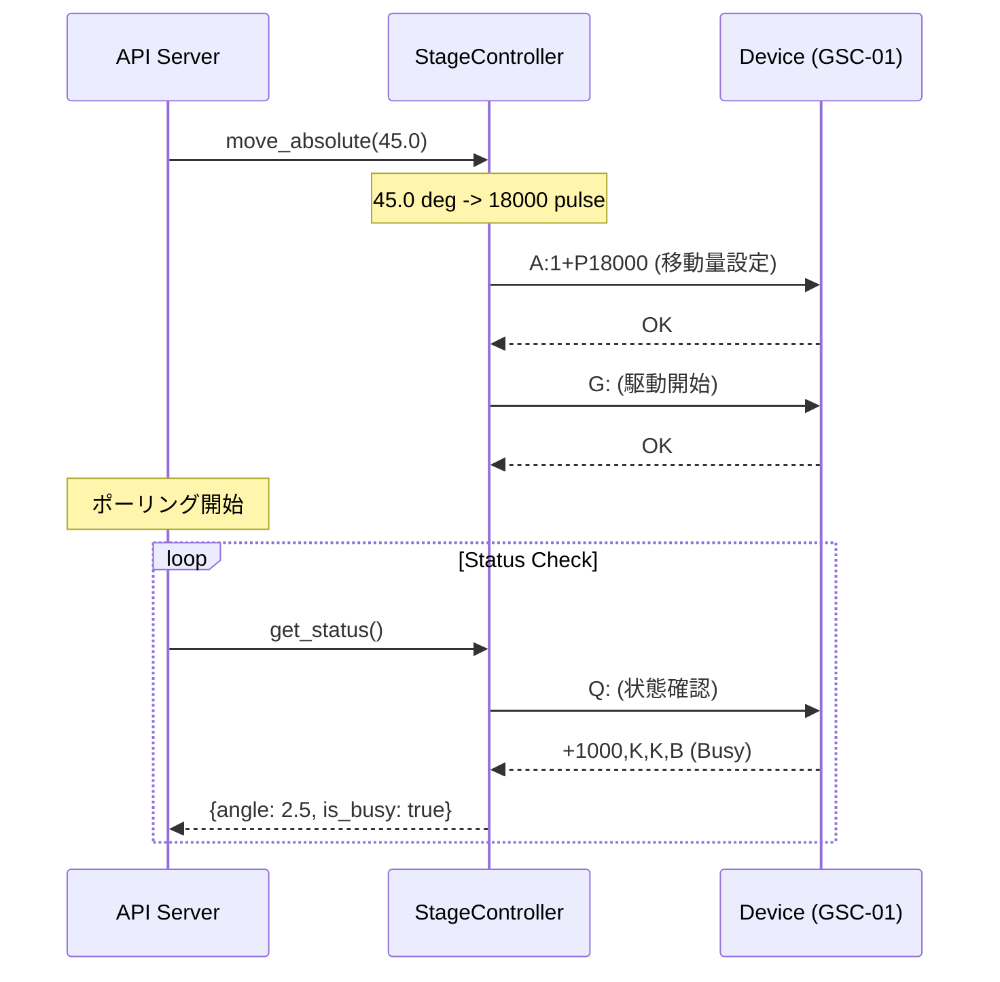

# 01. ハードウェア制御層 (Backend Devices)

このドキュメントでは、`backend/devices/` ディレクトリに配置されているハードウェア制御モジュールについて解説します。
本プロジェクトでは、**「ハードウェアの抽象化」** を徹底しており、上位レイヤー（APIサーバーやUI）は、接続先が実機かシミュレータ（Mock）かを意識せずに操作できるよう設計されています。

## 1. モジュール構成
OptoSigma製 GSC-01 (1軸ステージコントローラー) を制御するモジュールです。

| ファイル名             | クラス名           | 役割                                       | 制御対象                            |
| :--------------------- | :----------------- | :----------------------------------------- | :---------------------------------- |
| `stage_controller.py`  | `StageController`  | 回転ステージの角度制御、原点復帰、状態監視 | Sigma Koki GSC-01 (OSMS-60YAW)      |
| `camera_controller.py` | `CameraController` | 露光/ゲイン設定、画像キャプチャ、MJPEG配信 | Thorlabs DCC1545M (モノクロ, uc480) |

---

## 2. StageController (ステージ制御)

シグマ光機製の1軸ステージコントローラ `GSC-01` を介して、回転ステージ `OSMS-60YAW` を制御します。通信方式は RS-232C (USB-Serial) です。

- **File:** `backend/devices/stage_controller.py`
- **Device:** OptoSigma GSC-01 + OSMS-60YAW (回転ステージ)
- **Interface:** RS232C (Serial)

---
### 2.1. 接続仕様
- **Baudrate:** 9600 bps (Default)
- **Flow Control:** RTS/CTS (Hardware) - **必須**。これがないとコマンドを取りこぼす可能性があります。
- **Terminator:** CR+LF (`\r\n`)

### 2.2 Mock/Real 自動判定 (Simulation)
開発効率を高めるため、OS環境に応じた自動フォールバック機能を実装しています。
*   **Windows:** 実機接続 (`serial.Serial`) を試みます。失敗した場合はエラーを送出します（意図しないMock動作を防ぐため）。
*   **macOS / Linux:** `platform.system()` を検知し、強制的に **Mockモード** で起動します。
    *   Mockモードでは `time.sleep()` を用いて移動時間をシミュレートし、内部変数 `_mock_pulse` を更新します。また、ログ出力を `[STAGE-MOCK]` とすることで実機動作と明確に区別します。
*   **診断補足 (Windows):** `pyserial` の import に失敗した場合も `HAS_PYSERIAL=False` として Mock モードへ遷移します。
    *   失敗理由は `pyserial_import_error` に保持され、`/stage/diagnostics` API で確認可能です。

### 2.3 座標変換ロジック
- **分解能:** 0.0025度/パルス (Half step駆動時)
- **変換式:**
  - `Pulse = round(Angle * 400)`
  - `Angle = Pulse / 400`

> **Note: 丸め処理について (Why round?)**
>
> 初期の設計では `int()` による切り捨てを採用していましたが、以下の理由から `round()` による四捨五入に変更しました。
> 1.  **直感的な操作感 (UX):** ユーザーが入力した任意の角度に対して、物理的に可能な「最も近い位置」へ移動するのが計測機器としてあるべき挙動であるため。切り捨ての場合、0.0024度のような微小な入力が「0パルス（移動なし）」となり、ユーザーに「反応しない」という誤解を与えるリスクがありました。
> 2.  **誤差の均等化:** 切り捨て（床関数）は常に値を小さく見積もるバイアスがかかりますが、四捨五入（特にPythonの `round` は偶数丸め）は誤差の方向が分散するため、繰り返し操作による位置ズレの累積を統計的に抑制できます。

### 2.4 主要コマンド実装

| 機能     | GSC-01コマンド          | 実装メソッド               | 備考                                                       |
| :------- | :---------------------- | :------------------------- | :--------------------------------------------------------- |
| 原点復帰 | `H:1`                   | `home()`                   | 機械原点復帰。完了までブロックしません（Busy確認が必要）。 |
| 絶対移動 | `A:1+Pxxx` -> `G:`      | `move_absolute(deg)`       | 角度をパルスに変換して送信。                               |
| 相対移動 | `M:1+Pxxx` -> `G:`      | `move_relative(deg)`       | 現在地からの差分移動。                                     |
| 速度設定 | `D:1S{min}F{max}R{acc}` | `set_speed(min, max, acc)` | 起動速度(S), 最高速度(F), 加減速時間(R)を設定。            |
| 停止     | `L:1`                   | `stop(immediate=False)`    | 減速停止。                                                 |
| 非常停止 | `L:E`                   | `stop(immediate=True)`     | 即時停止（モーター励磁OFF等の挙動は設定依存）。            |
| 状態取得 | `Q:`                    | `get_status()`             | 座標とBusy状態(`B`/`R`)を取得。                            |

### 2.5 メソッド詳細リファレンス (StageController)
これらのメソッドは `backend/devices/stage_controller.py` に実装されています。

#### `connect(port: str, baudrate: int = 9600) -> bool`
指定されたCOMポートに接続します。

*   **実装詳細:**
    *   `serial.Serial` クラスのインスタンスを作成します。
    *   **設定パラメータ:**
        *   `rtscts=True`: ハードウェアフロー制御を有効にします。GSC-01はこれがないと通信を取りこぼすことがあります。
        *   `timeout=1.0`: 読み込み時にデータが来ない場合、1秒で諦めて処理を戻します（無限ブロック防止）。
*   **Mock時の挙動:** 実際には接続せず、`[STAGE-MOCK]` プレフィックス付きでログを出力して `True` を返します。

#### `home() -> bool`
機械原点復帰 (`H:1`) を実行します。

*   **実装詳細:**
    *   コマンド `H:1\r\n` を送信します。
    *   **注意:** このメソッドは「原点復帰命令の送信」が成功したら `True` を返します。「原点復帰の完了」を待つわけではありません。完了確認は `get_status` で `Busy` フラグが落ちるのを監視する必要があります。

#### `move_absolute(target_angle: float) -> bool`
絶対角度指定で移動します。
*   **安全装置:** `0.0` 〜 `360.0` 度の範囲外の入力はブロックします。

*   **コード解説:** 
    ```python
    # 1. 角度をパルスに変換 (例: 45度 -> 18000パルス)
    target_pulse = self._deg_to_pulse(target_angle)
    
    # 2. 符号の決定と絶対値化
    direction = "+" if target_pulse >= 0 else "-"
    abs_pulse = abs(target_pulse)
    
    # 3. 設定コマンド送信 (A:1+P18000)
    cmd_a = f"A:1{direction}P{abs_pulse}"
    self._send_command(cmd_a)
    
    # 4. 駆動コマンド送信 (G:)
    self._send_command("G:")
    ```

#### `move_relative(delta_angle: float) -> bool`
現在位置から相対移動します。
*   **安全装置 1:** 1回の移動量は `-360.0` 〜 `+360.0` 度の範囲内のみ許可します（誤入力による無限回転防止）。
*   **安全装置 2 (ケーブル保護):** 累積の角度が `±30000.0` 度（約80周）を超える移動をブロックし、原点復帰を促します。

#### `set_speed(min_pps: int, max_pps: int, accel_time_ms: int) -> bool`
起動速度、最高速度、加減速時間を設定します (`D:` コマンド)。

*   **ログフォーマット:**
    設定適用時、以下の形式でログが出力されます。
    ```text
    [STAGE] Set Speed: S={min_pps}, F={max_pps}, R={accel_time_ms}
    ```
    *   **S:** Start Speed (起動速度)
    *   **F:** Final Speed (最高速度)
    *   **R:** Rate/Time (加減速時間)

#### `get_status() -> Tuple[float, bool]`
現在の状態を問い合わせます (`Q:` コマンド)。

*   **戻り値:** `(現在の角度[deg], is_busyフラグ)`
*   **実装詳細:**
    *   デバイスからの応答文字列（例: `+18000,K,K,B`）をカンマ `,` で分割(`split`)して解析します。
    *   4番目の要素が `B` ならBusy（移動中）、`R` ならReady（停止中）と判定します。

#### `_mark_disconnected(reason: str) -> None`
USB抜き等の通信異常時に、接続状態を確実に落とします。

*   **パラメータ:**
    *   `reason`: 切断理由（ログ記録用）。例：`"Empty response"`、`"Serial error"`
*   **実装詳細:**
    *   `is_connected = False` を必ず設定します。
    *   シリアルポートが開いている場合は即座に `close()` します。
    *   例外は無視し、安全に処理を完了させます。
*   **目的:** 通信エラー発生時、フロントエンドの次のポーリングで確実に「切断」状態を検知させ、UIの状態を同期させるため。

#### `disconnect() -> None`
明示的なステージ切断（APIからの要求）を処理します。

*   **実装:** 内部的には `close()` を呼び出します。
*   **目的:** `/stage/disconnect` API エンドポイント経由でフロントエンドからの切断要求に対応するため。
*   **注意:** このメソッド自体は単なるエイリアスですが、APIレイヤーから明示的な意図をもって呼ばれることで、ログやモニタリングで区別可能にしています。

#### 診断用内部状態 (Stage)
ステージ接続の切り分け用に、以下の状態を内部で保持しています。

*   `has_pyserial`: pyserial import 成功可否。
*   `pyserial_import_error`: import失敗時の詳細メッセージ。
*   `last_error`: 直近の通信失敗理由。
*   `last_connected_port` / `last_baudrate`: 最後に接続を試みた設定値。

これらは `GET /stage/diagnostics` の応答として取得できます。

### 2.6 コマンド送信フロー
GSC-01の仕様上、移動コマンドは「移動量の設定」と「駆動開始」の2ステップに分かれています。



### 2.7. ログフォーマット
速度設定時のログ出力は以下のフォーマットに統一されています。
```text
[STAGE] Set Speed: S={min_pps}, F={max_pps}, R={accel_time_ms}
```
- **S (Start Speed):** 起動速度 (PPS)
- **F (Final/Max Speed):** 最高速度 (PPS)
- **R (Rate/Time):** 加減速時間 (ms)

---

## 3. CameraController (カメラ制御)

Thorlabs (IDS Imaging) 製のモノクロUSBカメラ `DCC1545M` を制御します。現在は `pylablib.devices.uc480`（`pylablib`）を用いる uc480 ドライバ経由の実装をメインとしています。

※移行期間中は既存の `pyueye` ベース実装を `camera_controller_old.py` として残し、環境によってフォールバックできる設計です。

### 3.1 基本仕様とパラメータ
- **Driver:** IDS `uc480` SDK / `pylablib.devices.uc480` (優先)。旧来の `pyueye` はフォールバックとして保持
- **Capture Format:** 16-bit RAW (Bayer) / 8-bit RAW 動的切替対応
- **Preview:** MJPEG Stream (HTTP)
- **Recording:** Multi-page TIFF (SSD直書き)
- **制御パラメータ:**
  - **Exposure:** 露光時間 (ms)。`set_exposure(ms)` にて制御。
  - **Gain:** ハードウェアゲイン (0-100)。`set_gain(val)` にて制御。
  - *(Note: Pixel Clock については、安定性のため現在ドライバのデフォルト値を使用しており手動制御は未実装です)*

### 3.2 画像取得フローとコード解説

画像データは、現在の `pylablib.devices.uc480` 実装では `self.camera.snap()` がPython側の配列として返します。呼び出し側が C言語レベルのメモリアドレス（ポインタ）を直接扱う必要はありません。

```python
# _grab_image_from_hardware_or_mock メソッドの詳細解説

# 1. 画像のキャプチャ
# uc480 バックエンド経由で現在のフレームを取得します。
frame = self.camera.snap()

# 2. 生データの取得
# snap() が返す Python 配列を、そのまま NumPy 配列として扱います。
raw_data = np.asarray(frame, dtype=np.uint16)

# 3. 形状確認
# 必要に応じて、受信した配列の shape が期待値と一致するか確認します。
image_data = raw_data

return image_data
```

### 3.3 Mock機能

`uc480` ライブラリがインストールされていない環境、またはmacOS環境では、自動的にMockモードになります。`_grab_image_from_hardware_or_mock` メソッド内で、`cv2.circle` や `np.random` を使って動的な画像を生成しています。
また、ログ出力を `[CAMERA-MOCK]` とすることで実機動作と明確に区別します。

#### import失敗時の挙動と診断

`uc480` の import が失敗した場合、以下の診断情報を保持します。

*   `uc480_import_error`: 例外メッセージ全文。
*   `has_uc480`: import 成功可否。

これらは `GET /camera/diagnostics` で取得でき、`uc480` 本体不在とドライバ解決失敗の切り分けに使います。

### 3.4 メソッド詳細リファレンス (CameraController)

#### `connect(camera_id: int = 0) -> bool`
*   **処理内容:**
    1.  ドライバ初期化 (`pylablib.devices.uc480` の初期化関数を呼びます)。
    2.  画像モード（RAW16 / 8-bit 等）やカラーモードを設定して、取得フォーマットを決定します。
    3.  画像バッファの確保と初期化を行います。
    4.  画像取得の準備完了後は、以後の取得で `snap()` が配列を返す前提で扱います。

> 注意: `_reallocate_memory` は旧 `pyueye` 実装側の説明です。現在の `uc480` 実装では、画像取得時に呼び出し側が明示的にメモリ再確保を行う想定ではありません。

**補足 (Bayer / 色変換):**
移行に伴い、OpenCVの色変換コードをハードコーディングするのをやめ、カメラの `bayer_pattern` を参照して動的に `cv2` の変換コードを選ぶヘルパー (`_get_bayer_color_conversion_code()`) を導入しました。`take_snapshot()` とプレビュー生成でこのヘルパーを使用しています。これにより、センサーのBayer配列が変わっても正しいデモザイクが適用される設計です。

#### `generate_frames()`
*   **役割:** MJPEGストリーミングのための無限ジェネレータ（各駅停車レーン）。
*   **実装詳細:** 
    *   キュー（Queue）ではなく **Condition（黒板とベル方式）** を採用。
    *   `wait()` で待機し、特急レーンから通知（ベル）が来たら最新画像（黒板）を取得して配信します。これにより複数画面を開いてもフレームの奪い合いが起きません。

#### `get_available_cameras()`
接続されているuc480対応カメラのリストをハードウェアから直接取得します。
*   **実装:** `uc480.list_cameras()` を呼び出し、各カメラ記述子オブジェクトから `cam_id`, `model`, `serial_number` を抽出して、UIが扱いやすい形式（`{"id": ..., "name": ..., "model": ..., "serial": ...}`）に正規化して返します。

#### `_capture_loop()`
キャプチャ専用のバックグラウンドスレッド（特急レーン）で実行される関数です。
*   **役割:** カメラから全速力で画像を取得し、最新フレームを更新（ブロードキャスト）し続けます。
*   **録画時:** `is_recording = True` の場合、ここで直接 `tifffile.TiffWriter` を用いてディスクへ追記書き込み（SSD直書き）を行います。JPEGエンコード等の重い処理を介さないため、ボトルネックが発生しません。

#### `take_snapshot() -> Optional[str]`
*   **役割:** 最新フレームの静止画取得と保存を行います。設定に応じて自動保存するか、メモリに保持してフロントエンドからの指示（ダイアログ）を待ちます。

#### `start_recording() -> bool`
*   **役割:** マルチページTIFFとCSVへの超高速直書きを開始します。必要なビット深度や出力形式は `uc480` 側の取得設定に従います。

#### `stop_recording() -> Optional[str]`
*   **役割:** TIFF書き込みを終了し、必要に応じて16-bit待機モードへ復帰します。自動MP4変換がONの場合は非同期の「貨物レーン」スレッドを起動します。

---

## 4. 開発者向けガイド: Python実装の基礎

このセクションでは、本モジュールで使用されているPython特有の機能や用語について解説します。

### クラス (`class`) と インスタンス (`self`)
*   **クラス:** 設計図です。「ステージコントローラーとはこういう機能を持つものだ」という定義です。
*   **インスタンス:** 実体です。`stage = StageController()` と書くと、メモリ上に1つの「制御装置」が生まれます。
*   **`self`:** メソッドの中で「自分自身」を指す言葉です。`self.ser` と書けば、そのインスタンスが持っている `ser` 変数にアクセスできます。

### Mock（モック）パターン
ハードウェア開発の定石です。「偽物」を作ることで、本物が手元になくてもアプリ開発を進められるようにします。
このコードでは `is_mock_env` フラグで分岐させ、偽のデータを返すようにしています。これにより、電車の中でもカフェでも開発が可能になります。

### ジェネレータ (`yield`)
通常の関数は `return` で値を返すと終了してメモリから消えますが、ジェネレータは `yield` で値を返した後、**その状態を保持したまま一時停止**します。
次に呼ばれると続きから動きます。これを使わないと、無限ループで画像をリストに詰め込み続けてメモリがパンクするか、1枚返して終わってしまいます。「無限のデータの流れ」を表現するのに最適です。

### 例外処理 (`try-except`)
ハードウェアは物理的な切断などでエラーを起こしやすいです。
```python
try:
    # 危険な処理（通信など）
    self.ser.write(...)
except Exception as e:
    # エラーが起きた時の処理
    logger.error(f"Error: {e}")
```
このように書くことで、エラーが起きてもプログラム全体がクラッシュ（強制終了）するのを防ぎ、ログを残して安全に停止させることができます。

### Tuple（タプル）
`get_status` の戻り値 `Tuple[float, bool]` などで使われています。
*   リスト `[1, 2]` と似ていますが、タプル `(1, 2)` は**中身を変更できません**。
*   関数の戻り値として「複数の値をセットで返したい」ときによく使われます。ここでは「角度」と「Busy状態」という2つの情報をセットにして返しています。
*Last Updated: 2026-04-06*
