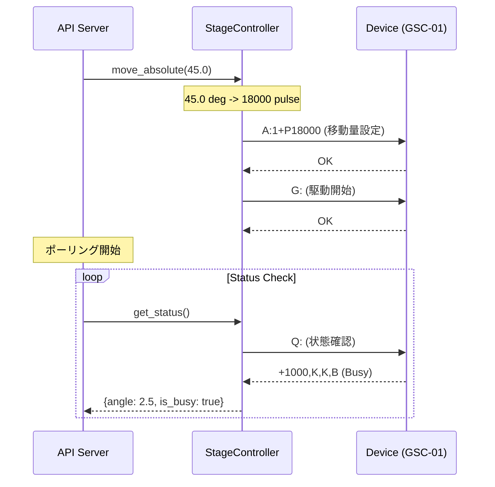

# 01. ハードウェア制御層 (Backend Devices)

このドキュメントでは、`backend/devices/` ディレクトリに配置されているハードウェア制御モジュールについて解説します。
本プロジェクトでは、**「ハードウェアの抽象化」** を徹底しており、上位レイヤー（APIサーバーやUI）は、接続先が実機かシミュレータ（Mock）かを意識せずに操作できるよう設計されています。

## 1. モジュール構成
OptoSigma製 GSC-01 (1軸ステージコントローラー) を制御するモジュールです。

| ファイル名             | クラス名           | 役割                                       | 制御対象                                            |
| :--------------------- | :----------------- | :----------------------------------------- | :-------------------------------------------------- |
| `stage_controller.py`  | `StageController`  | 回転ステージの角度制御、原点復帰、状態監視 | Sigma Koki GSC-01 (OSMS-60YAW)                      |
| `camera_controller.py` | `CameraController` | 露光/ゲイン設定、画像キャプチャ、MJPEG配信 | Thorlabs DCC1545M (モノクロ, uc480 / `UC480Camera`) |

---

## 2. StageController (ステージ制御)

シグマ光機製の1軸ステージコントローラ `GSC-01` を介して、回転ステージ `OSMS-60YAW` を制御します。通信方式は RS-232C (USB-Serial) です。

- **File:** `backend/devices/stage_controller.py`
- **Device:** OptoSigma GSC-01 + OSMS-60YAW (回転ステージ)
- **Interface:** RS232C (Serial)

---
### 2.1. 接続仕様
- **Baudrate:** 9600 bps (Default)
- **Flow Control:** RTS/CTS (Hardware) - **必須**。これがないとコマンドを取りこぼす可能性があります。
- **Terminator:** CR+LF (`\r\n`)

### 2.2 Mock/Real 自動判定 (Simulation)
開発効率を高めるため、OS環境に応じた自動フォールバック機能を実装しています。
*   **Windows:** 実機接続 (`serial.Serial`) を試みます。失敗した場合はエラーを送出します（意図しないMock動作を防ぐため）。
*   **macOS / Linux:** `platform.system()` を検知し、強制的に **Mockモード** で起動します。
    *   Mockモードでは `time.sleep()` を用いて移動時間をシミュレートし、内部変数 `_mock_pulse` を更新します。また、ログ出力を `[STAGE-MOCK]` とすることで実機動作と明確に区別します。
*   **診断補足 (Windows):** `pyserial` の import に失敗した場合も `HAS_PYSERIAL=False` として Mock モードへ遷移します。
    *   失敗理由は `pyserial_import_error` に保持され、`/stage/diagnostics` API で確認可能です。

### 2.3 座標変換ロジック
- **分解能:** 0.0025度/パルス (Half step駆動時)
- **変換式:**
  - `Pulse = round(Angle * 400)`
  - `Angle = Pulse / 400`

> **Note: 丸め処理について (Why round?)**
>
> 初期の設計では `int()` による切り捨てを採用していましたが、以下の理由から `round()` による四捨五入に変更しました。
> 1.  **直感的な操作感 (UX):** ユーザーが入力した任意の角度に対して、物理的に可能な「最も近い位置」へ移動するのが計測機器としてあるべき挙動であるため。切り捨ての場合、0.0024度のような微小な入力が「0パルス（移動なし）」となり、ユーザーに「反応しない」という誤解を与えるリスクがありました。
> 2.  **誤差の均等化:** 切り捨て（床関数）は常に値を小さく見積もるバイアスがかかりますが、四捨五入（特にPythonの `round` は偶数丸め）は誤差の方向が分散するため、繰り返し操作による位置ズレの累積を統計的に抑制できます。

### 2.4 エラーハンドリングと例外設計
ハードウェアに起因する操作エラーを明確に区別するため、専用の例外クラス **`StageCommandError`** を定義しています。
*   **用途:** クライアント側の入力フォーマットエラー（`ValueError` / HTTP 400）とは異なり、機器保護ルール（累積パルス超過、原点未復帰など）やデバイス側から拒否応答があった場合にスローされます。
*   **API層の対応:** API サーバーはこの例外を捕捉し、**HTTP 409 Conflict** としてフロントエンドに返します。これにより、UI側で「機器状態の競合（ホーム要求など）」を適切にユーザーへ通知できます。

### 2.5 主要コマンド実装

| 機能     | GSC-01コマンド          | 実装メソッド               | 備考                                                       |
| :------- | :---------------------- | :------------------------- | :--------------------------------------------------------- |
| 原点復帰 | `H:1`                   | `home()`                   | 機械原点復帰。完了までブロックしません（Busy確認が必要）。 |
| 絶対移動 | `A:1+Pxxx` -> `G:`      | `move_absolute(deg)`       | 角度をパルスに変換して送信。                               |
| 相対移動 | `M:1+Pxxx` -> `G:`      | `move_relative(deg)`       | 現在地からの差分移動。                                     |
| 速度設定 | `D:1S{min}F{max}R{acc}` | `set_speed(min, max, acc)` | 起動速度(S), 最高速度(F), 加減速時間(R)を設定。            |
| 停止     | `L:1`                   | `stop(immediate=False)`    | 減速停止。                                                 |
| 非常停止 | `L:E`                   | `stop(immediate=True)`     | 即時停止（モーター励磁OFF等の挙動は設定依存）。            |
| 状態取得 | `Q:`                    | `get_status()`             | 座標とBusy状態(`B`/`R`)を取得。                            |

### 2.6 メソッド詳細リファレンス (StageController)
これらのメソッドは `backend/devices/stage_controller.py` に実装されています。

#### 排他制御と直列化 (`_io_lock` と `is_priority_locked`)
ステージコントローラへのシリアル通信において、移動コマンド（`A:`/`M:`/`G:` など）と非同期のポーリングコマンド（`Q:`）が競合し、通信の取り違えやデータの断片化が発生するのを防ぐため、内部メソッド `_send_command_locked` による厳密な直列化（Thread Lock）を行っています。

さらに、GSC-01コントローラ特有の「前処理の完了直後に次のコマンドを受けるとNGを返す」という問題を防ぐため、**優先制御フラグ (`is_priority_locked`)** を導入しています。移動コマンド（`move_absolute` や `home`）の送信開始前にこのフラグを立てることで、常時監視タスク（`try_get_status`）が通信を一時的に自制（スキップ）し、シリアルポートを確実に独占する「交通整理」を実現しています。

#### `connect(port: str, baudrate: int = 9600) -> bool`
指定されたCOMポートに接続します。

*   **実装詳細:**
    *   `serial.Serial` クラスのインスタンスを作成します。
    *   **設定パラメータ:**
        *   `rtscts=True`: ハードウェアフロー制御を有効にします。GSC-01はこれがないと通信を取りこぼすことがあります。
        *   `timeout=1.0`: 読み込み時にデータが来ない場合、1秒で諦めて処理を戻します（無限ブロック防止）。
*   **Mock時の挙動:** 実際には接続せず、`[STAGE-MOCK]` プレフィックス付きでログを出力して `True` を返します。

#### `home() -> bool`
機械原点復帰 (`H:1`) を実行します。

*   **実装詳細:**
    *   コマンド `H:1\r\n` を送信します。
    *   **注意:** このメソッドは「原点復帰命令の送信」が成功したら `True` を返します。「原点復帰の完了」を待つわけではありません。完了確認は `get_status` で `Busy` フラグが落ちるのを監視する必要があります。

#### `move_absolute(target_angle: float) -> bool`
絶対角度指定で移動します。
*   **安全装置:** `0.0` 〜 `360.0` 度の範囲外の入力はブロックします。

*   **コード解説:** 
    ```python
    # 1. 角度をパルスに変換 (例: 45度 -> 18000パルス)
    target_pulse = self._deg_to_pulse(target_angle)
    
    # 2. 符号の決定と絶対値化
    direction = "+" if target_pulse >= 0 else "-"
    abs_pulse = abs(target_pulse)
    
    # 3. 設定コマンド送信 (A:1+P18000)
    cmd_a = f"A:1{direction}P{abs_pulse}"
    self._send_command(cmd_a)
    
    # 4. 駆動コマンド送信 (G:)
    self._send_command("G:")
    ```

#### `move_relative(delta_angle: float) -> bool`
現在位置から相対移動します。
*   **安全装置 1:** 1回の移動量は `-360.0` 〜 `+360.0` 度の範囲内のみ許可します（誤入力による無限回転防止）。
*   **安全装置 2 (ケーブル保護):** 累積の角度が `±30000.0` 度（約80周）を超える移動をブロックし、原点復帰を促します。

#### `set_speed(min_pps: int, max_pps: int, accel_time_ms: int) -> bool`
起動速度、最高速度、加減速時間を設定します (`D:` コマンド)。

*   **ログフォーマット:**
    設定適用時、以下の形式でログが出力されます。
    ```text
    [STAGE] Set Speed: S={min_pps}, F={max_pps}, R={accel_time_ms}
    ```
    *   **S:** Start Speed (起動速度)
    *   **F:** Final Speed (最高速度)
    *   **R:** Rate/Time (加減速時間)

**接続されていない場合の挙動（キャッシュ）**

`/system/settings` などで速度設定が送られてきた際、ステージが未接続だと即時にハードウェアへ反映できません。そのためバックエンドは受領した `min_pps` / `max_pps` / `accel_time_ms` を内部変数（`stage.speed_min_pps`, `stage.speed_max_pps`, `stage.speed_accel_ms`）に保持し、`connect()` 実行時にそれらを再適用する実装になっています。

この方式により、ユーザーが先に設定を保存してからケーブルを接続した場合でも、期待どおりの速度設定が接続時に確実に適用されます。

#### `get_status() -> Tuple[float, bool]`
現在の状態を問い合わせます (`Q:` コマンド)。

*   **戻り値:** `(現在の角度[deg], is_busyフラグ)`
*   **実装詳細とパースの工夫 (`_parse_status_response`):**
    *   デバイスからの応答文字列（例: `+18000,K,K,B`）をカンマ `,` で分割して解析します。4番目の要素が `B` ならBusy、`R` ならReadyと判定します。
    *   実機では、パルス値が固定幅の符号付き文字列として返され、内部にスペースが混入するケースがあります（例: `"-      499"`）。この空白を除去せずに `int()` へ渡すとキャストエラーになるため、内部で正規表現 (`re.sub(r"\s+", "", ...)`) を用いて安全に不要な空白を取り除く共通ヘルパーを導入しています。

#### `_mark_disconnected(reason: str) -> None`
USB抜き等の通信異常時に、接続状態を確実に落とします。

*   **パラメータ:**
    *   `reason`: 切断理由（ログ記録用）。例：`"Empty response"`、`"Serial error"`
*   **実装詳細:**
    *   `is_connected = False` を必ず設定します。
    *   シリアルポートが開いている場合は即座に `close()` します。
    *   例外は無視し、安全に処理を完了させます。
*   **目的:** 通信エラー発生時、フロントエンドの次のポーリングで確実に「切断」状態を検知させ、UIの状態を同期させるため。

#### `disconnect() -> None`
明示的なステージ切断（APIからの要求）を処理します。

*   **実装:** 内部的には `close()` を呼び出します。
*   **目的:** `/stage/disconnect` API エンドポイント経由でフロントエンドからの切断要求に対応するため。
*   **注意:** このメソッド自体は単なるエイリアスですが、APIレイヤーから明示的な意図をもって呼ばれることで、ログやモニタリングで区別可能にしています。

#### 診断用内部状態 (Stage)
ステージ接続の切り分け用に、以下の状態を内部で保持しています。

*   `has_pyserial`: pyserial import 成功可否。
*   `pyserial_import_error`: import失敗時の詳細メッセージ。
*   `last_error`: 直近の通信失敗理由。
*   `last_connected_port` / `last_baudrate`: 最後に接続を試みた設定値。

これらは `GET /stage/diagnostics` の応答として取得できます。

### 2.7 コマンド送信フロー
GSC-01の仕様上、移動コマンドは「移動量の設定」と「駆動開始」の2ステップに分かれています。


```mermaid
sequenceDiagram
    participant API as API Server
    participant Ctrl as StageController
    participant Dev as Device (GSC-01)

    API->>Ctrl: move_absolute(45.0)
    Note over Ctrl: 45.0 deg -> 18000 pulse
    
    Ctrl->>Dev: A:1+P18000 (移動量設定)
    Dev-->>Ctrl: OK
    
    Ctrl->>Dev: G: (駆動開始)
    Dev-->>Ctrl: OK
    
    Note over API: ポーリング開始
    loop Status Check
        API->>Ctrl: get_status()
        Ctrl->>Dev: Q: (状態確認)
        Dev-->>Ctrl: +1000,K,K,B (Busy)
        Ctrl-->>API: {angle: 2.5, is_busy: true}
    end
```

### 2.8. ログフォーマット
速度設定時のログ出力は以下のフォーマットに統一されています。
```text
[STAGE] Set Speed: S={min_pps}, F={max_pps}, R={accel_time_ms}
```
- **S (Start Speed):** 起動速度 (PPS)
- **F (Final/Max Speed):** 最高速度 (PPS)
- **R (Rate/Time):** 加減速時間 (ms)

---

## 3. CameraController (カメラ制御)

Thorlabs (IDS Imaging) 製のモノクロUSBカメラ `DCC1545M` を制御します。現在は `pylablib.devices.uc480`（`pylablib`）を用いる uc480 ドライバ経由の実装をメインとしています。実機ハンドルは `uc480.UC480Camera` で生成します（実装では `from pylablib.devices import uc480` でインポート済み）。

※移行期間中は既存の `pyueye` ベース実装を `camera_controller_old.py` として残し、環境によってフォールバックできる設計です。

### 3.1 基本仕様とパラメータ
- **Driver:** IDS `uc480` SDK / `pylablib.devices.uc480` (優先)。旧来の `pyueye` はフォールバックとして保持
- **Capture Format:** 16-bit RAW (Bayer) / 8-bit RAW 動的切替対応
- **Preview:** MJPEG Stream (HTTP)
- **Recording:** Multi-page TIFF (SSD直書き)
- **制御パラメータ:**
  - **Exposure:** 露光時間 (ms)。`set_exposure(ms)` にて制御。
  - **Gain:** ハードウェアゲイン (0-100)。`set_gain(val)` にて制御。
  - *(Note: Pixel Clock については、安定性のため現在ドライバのデフォルト値を使用しており手動制御は未実装です)*

**互換性と追加API:**
- 最近の修正で `CameraController` は既存の setter に加えて互換性のためのアクセサ `get_exposure()` と `get_gain()` を追加しました。これにより外部から現在の露光/ゲイン値を安全に取得できます。既存の UI や外部スクリプトがこれらの値を参照している場合、`get_*` 系の存在を前提にできます。

**テストとドキュメント:**
- 本プロジェクトでは実機がない環境でも早期に問題を検出するため、`pylablib` の `uc480` を置き換える Mock 実装を用いたユニットテスト群を用意しています。
- デバイス層の主なテスト対象は、`backend/tests/devices/test_camera_controller.py`、`test_exposure_edge_cases.py`、`test_exposure_unit_mismatch.py`、`test_disconnect_during_recording.py` です。
- これらでは `connect()` / `disconnect()`、露光・ゲインの往復、`get_exposure_range()`、録画停止時の競合、Bayer 変換の判定ロジックを確認します。
- テスト実行手順や設計方針は `spec/12_testing.md` にまとめていますので、開発前にそちらを参照してください。

### 3.2 画像取得フローとコード解説

画像データは、現在の `pylablib.devices.uc480` 実装では `self.camera.snap()` がPython側の配列として返します。呼び出し側が C言語レベルのメモリアドレス（ポインタ）を直接扱う必要はありません。

```python
# _grab_image_from_hardware_or_mock メソッドの詳細解説

# 1. 画像のキャプチャ
# uc480 バックエンド経由で現在のフレームを取得します。
frame = self.camera.snap()

# 2. 生データの取得
# snap() が返す Python 配列を、そのまま NumPy 配列として扱います。
raw_data = np.asarray(frame, dtype=np.uint16)

# 3. 形状確認
# 必要に応じて、受信した配列の shape が期待値と一致するか確認します。
image_data = raw_data

return image_data
```

### 3.3 Mock機能

`uc480` ライブラリがインストールされていない環境、またはmacOS環境では、自動的にMockモードになります。`_grab_image_from_hardware_or_mock` メソッド内で、`cv2.circle` や `np.random` を使って動的な画像を生成しています。
また、ログ出力を `[CAMERA-MOCK]` とすることで実機動作と明確に区別します。

#### import失敗時の挙動と診断

`uc480` の import が失敗した場合、以下の診断情報を保持します。

*   `uc480_import_error`: 例外メッセージ全文。
*   `has_uc480`: import 成功可否。

これらは `GET /camera/diagnostics` で取得でき、`uc480` 本体不在とドライバ解決失敗の切り分けに使います。

### 3.4 メソッド詳細リファレンス (CameraController)

#### `connect(camera_id: int = 0) -> bool`
*   **処理内容:**
    1.  ドライバ初期化 (`pylablib.devices.uc480` の初期化関数を呼びます)。
    2.  実機接続時は `uc480.list_cameras()` で候補を列挙し、対象 `cam_id` を選択します。
    3.  `self.camera = uc480.UC480Camera(cam_id=target_camera.cam_id)` として接続ハンドルを生成します（実装では `from pylablib.devices import uc480` でインポート済み）。
    4.  画像モード（RAW16 / 8-bit 等）やカラーモードを設定して、取得フォーマットを決定します。
    5.  画像バッファの確保と初期化を行います。
    6.  接続直後に露光/ゲイン範囲をキャッシュし、`set_exposure()` / `set_gain()` を初期適用します。
*   **注意:** 接続直後のログで `Camera not connected, cannot set exposure/gain` が出る場合は、接続フラグの立て順または初期同期の失敗を疑います。

#### `get_exposure_range() -> tuple[float, float, float] | None`
*   **用途:** UI スライダーの min/max/step を決めるための能力値を返します。
*   **実装方針:** 実機では `is_Exposure` 系 API から取得し、Mock では固定値を返します。
*   **注意:** ここで得たレンジは `set_exposure()` のクランプ基準になります。レンジが極端に大きい場合は、単位変換ミスの疑いがあります。
    6.  画像取得の準備完了後は、以後の取得で `snap()` が配列を返す前提で扱います。

> 注意: `_reallocate_memory` は旧 `pyueye` 実装側の説明です。現在の `uc480` 実装では、画像取得時に呼び出し側が明示的にメモリ再確保を行う想定ではありません。

**補足 (Bayer / 色変換):**
移行に伴い、OpenCVの色変換コードをハードコーディングするのをやめ、カメラの `bayer_pattern` を参照して動的に `cv2` の変換コードを選ぶヘルパー (`_get_bayer_color_conversion_code()`) を導入しました。`take_snapshot()` とプレビュー生成でこのヘルパーを使用しています。これにより、センサーのBayer配列が変わっても正しいデモザイクが適用される設計です。

#### `generate_frames()`
*   **役割:** MJPEGストリーミングのための無限ジェネレータ（各駅停車レーン）。
*   **実装詳細:** 
    *   キュー（Queue）ではなく **Condition（黒板とベル方式）** を採用。
    *   `wait()` で待機し、特急レーンから通知（ベル）が来たら最新画像（黒板）を取得して配信します。これにより複数画面を開いてもフレームの奪い合いが起きません。

#### `get_available_cameras()`
接続されているuc480対応カメラのリストをハードウェアから直接取得します。
*   **実装:** `uc480.list_cameras()` を呼び出し、各カメラ記述子オブジェクトから `cam_id`, `model`, `serial_number` を抽出して、UIが扱いやすい形式（`{"id": ..., "name": ..., "model": ..., "serial": ...}`）に正規化して返します。

#### `_capture_loop()`
キャプチャ専用のバックグラウンドスレッド（特急レーン）で実行される関数です。
*   **役割:** カメラから全速力で画像を取得し、最新フレームを更新（ブロードキャスト）し続けます。
*   **録画時:** `is_recording = True` の場合、ここで直接 `tifffile.TiffWriter` を用いてディスクへ追記書き込み（SSD直書き）を行います。JPEGエンコード等の重い処理を介さないため、ボトルネックが発生しません。

#### `take_snapshot() -> Optional[str]`
*   **役割:** 最新フレームの静止画取得と保存を行います。設定に応じて自動保存するか、メモリに保持してフロントエンドからの指示（ダイアログ）を待ちます。

#### `prepare_recording() -> bool` / `trigger_recording() -> bool` / `start_recording() -> bool`
*   **非同期準備の仕組み**: ファイルシステムのI/O遅延がSweep測定時の録画トリガー（角度判定）を阻害しないよう、録画開始処理は2段階に分離されています。
    *   **`prepare_recording()`**: TIFFファイルとCSVファイルを事前に作成・オープンし、ヘッダーを書き込みます。この時点ではまだ録画は開始されず（`is_recording = False`）、スタンバイ状態となります。
    *   **`trigger_recording()`**: スタンバイ状態から即座に `is_recording = True` に切り替えます。フラグ操作のみの軽量な処理であるため、遅延ゼロで録画を開始できます。
    *   **`start_recording()`**: 上記2つを連続して実行するラッパーです。手動録画時など、即時性が厳密に問われない場面で使用されます。
*   **ログ:** `Recording prepare requested` → `Recording target path` → `Recording prepared (standby)` → `Recording triggered` の順で追跡します。
*   **注意:** 録画停止直後に `Error writing frame to TIFF/CSV` が1回だけ出ても、`Recording stopped` と `videos/` 内の実ファイルが残っていれば、停止と書き込みの競合ログである可能性があります。

#### `stop_recording() -> Optional[str]`
*   **役割:** TIFF書き込みを終了し、必要に応じて16-bit待機モードへ復帰します。自動MP4変換がONの場合は非同期の「貨物レーン」スレッドを起動します。
*   **実装補足:** writer 参照はロックで保護され、停止中にキャプチャループが `NoneType` の writer を触らないようにしています。

## 4. ROIProcessor (解析エンジン)

画像データ（NumPy配列）から特定の関心領域（ROI）を抽出し、物理量を算出するための高速計算エンジンです。

- **File:** `backend/utils/roi_processor.py`
- **主要技術:** NumPy (ベクトル演算), OpenCV (座標変換)

### 4.1. 主要な計算項目
| 項目 | 計算内容 | 物理的意味 |
| :--- | :--- | :--- |
| **Sum** | 領域内の全ピクセル値の合計 | 粒子の散乱光強度（メインの測定値） |
| **Max** | 領域内の最大ピクセル値 | センサーの飽和（白飛び）確認用 |
| **Center** | ROIの中心ピクセルの生の値 | 定点観測による信号強度の指標 |
| **Centroid** | 輝度で重み付けした座標の加重平均 | 粒子の中心位置、アライメントズレの検出 |

### 4.2. パフォーマンスと堅牢性
*   **高速性:** NumPy のスライス機能とベクトル演算を利用。パッチサイズが小さい（例: 5x5）場合、計算時間は数マイクロ秒であり、30fps以上のリアルタイム処理においても CPU 負荷は無視できるレベルです。
*   **ROI初期サイズ:** デフォルトでは **5x5** ピクセルが使用されます。
*   **境界チェック:** ROI が画像の外にはみ出した場合でも、`max(0, ...)` / `min(width, ...)` によるクランプ処理により、IndexError を起こさず安全に計算を継続します。
*   **サブピクセル座標:** 内部的には浮動小数点数で重心を計算し、小数点第3位まで保持することで、ピクセル単位以下の微小な動きを捉えることができます。

---

## 5. CameraController (カメラ制御・解析連携)

Thorlabs/IDS製カメラの制御に加え、取得した画像のリアルタイム解析と精密測定の同期を担当します。

### 5.1. データ経路の分離（二重経路設計）
測定データの信頼性とプレビューの滑らかさを両立するため、内部で以下の2つの経路を使い分けています。

1.  **モニタリング経路 (リアルタイム路):**
    *   `_capture_loop` 内で毎フレーム実行。
    *   最新の1点のみを `latest_roi_stats` に保持し、UIのリアルタイム更新（ミニテーブル等）に使用します。
    *   **プレビュー品質:** MJPEG配信時のJPEG品質パラメータを **98** に設定しています。これにより、プレビュー画面上でも画素の境界が可能な限り鮮明に保たれ、ピクセル単位のアライメントが容易になります。
2.  **精密測定経路 (確定路):**
    *   `take_snapshot()` 呼び出し時に実行。
    *   画像を `copy()` して確保し、その「確定した1枚」に対して再計算を行います。
    *   **意図:** 保存される画像と記録される数値を 1:1 で完全に一致させるため。

### 5.2. 主要メソッドの更新

#### `take_snapshot(filename_override=None, save_dir_override=None) -> Optional[dict]`
従来の「ファイルパスを返すだけ」の機能から、**「撮影・解析・保存のパッケージ」**を返す機能に進化しました。
*   **引数:**
    *   `filename_override`: 自動測定などで、特定のファイル名（例：角度付き）で保存したい場合に指定します。
    *   `save_dir_override`: 設定画面のデフォルトパスではなく、特定のフォルダ（測定セッション用など）に保存したい場合に指定します。
*   **戻り値:**
    *   `angle`: 撮影時のステージ角度（理想値）。
    *   `roi_stats`: 確保された画像から、その瞬間に再計算された最新の ROI 解析結果。
    *   `filepath`: 保存先パス。自動測定時は指定されたパス、手動時は `"PENDING"` または自動生成パス。
    *   `timestamp`: 撮影完了時刻。
*   **特徴:** 
    *   **整合性の保証**: メソッド内で画像を `copy()` して確保するため、保存された画像ファイルと `roi_stats` の数値は、1パルス・1ピクセルの狂いもなく完全に一致します。
    *   **柔軟な保存先**: オーバーライド引数により、通常のスナップショット設定を汚すことなく、自動測定シーケンスが独自のディレクトリ構造でデータを管理することを可能にしています。


#### `set_centroid_calc_enabled(enabled: bool)`
重心計算（Centroid）の有効/無効を切り替えます。
*   **用途:** 精密アライメント時は `True` にし、高速な自動掃引測定（Sweep）で計算負荷を最小限に抑えたい場合は `False` にする、といった運用が可能です。

#### `set_rois(rois: list)`
解析対象となる ROI リスト（中心座標とサイズ）を更新します。この設定は、リアルタイム表示と Snapshot 解析の両方に即座に反映されます。

### クラス (`class`) と インスタンス (`self`)
*   **クラス:** 設計図です。「ステージコントローラーとはこういう機能を持つものだ」という定義です。
*   **インスタンス:** 実体です。`stage = StageController()` と書くと、メモリ上に1つの「制御装置」が生まれます。
*   **`self`:** メソッドの中で「自分自身」を指す言葉です。`self.ser` と書けば、そのインスタンスが持っている `ser` 変数にアクセスできます。

### Mock（モック）パターン
ハードウェア開発の定石です。「偽物」を作ることで、本物が手元になくてもアプリ開発を進められるようにします。
このコードでは `is_mock_env` フラグで分岐させ、偽のデータを返すようにしています。これにより、電車の中でもカフェでも開発が可能になります。

### ジェネレータ (`yield`)
通常の関数は `return` で値を返すと終了してメモリから消えますが、ジェネレータは `yield` で値を返した後、**その状態を保持したまま一時停止**します。
次に呼ばれると続きから動きます。これを使わないと、無限ループで画像をリストに詰め込み続けてメモリがパンクするか、1枚返して終わってしまいます。「無限のデータの流れ」を表現するのに最適です。

### 例外処理 (`try-except`)
ハードウェアは物理的な切断などでエラーを起こしやすいです。
```python
try:
    # 危険な処理（通信など）
    self.ser.write(...)
except Exception as e:
    # エラーが起きた時の処理
    logger.error(f"Error: {e}")
```
このように書くことで、エラーが起きてもプログラム全体がクラッシュ（強制終了）するのを防ぎ、ログを残して安全に停止させることができます。

### Tuple（タプル）
`get_status` の戻り値 `Tuple[float, bool]` などで使われています。
*   リスト `[1, 2]` と似ていますが、タプル `(1, 2)` は**中身を変更できません**。
*   関数の戻り値として「複数の値をセットで返したい」ときによく使われます。ここでは「角度」と「Busy状態」という2つの情報をセットにして返しています。
*Last Updated: 2026-06-16*
