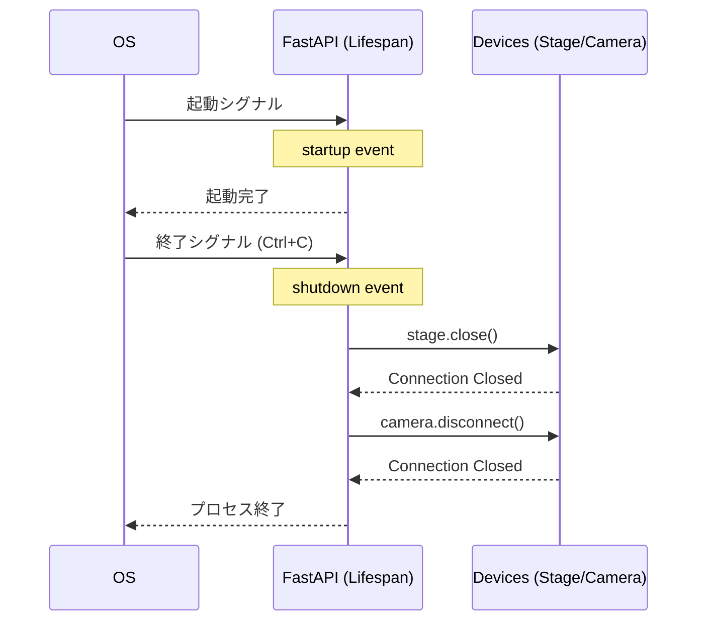
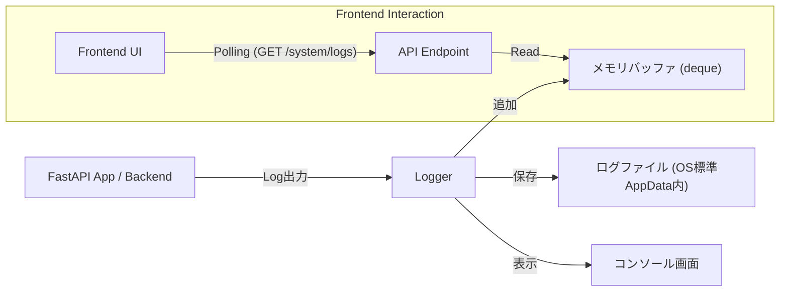

# 02. APIサーバー・システム層 (Backend Server)

このドキュメントでは、`backend/main.py` および `backend/utils/logger.py` を中心とした、サーバーサイドの実装詳細について解説します。
本システムは **Python (FastAPI)** を採用し、非同期処理と型安全性を重視した設計となっています。

## 1. サーバーアーキテクチャ概要

### 1.1 技術スタック
*   **フレームワーク:** FastAPI
*   **サーバー:** Uvicorn (ASGI)
*   **バリデーション:** Pydantic V2
*   **CORS:** フロントエンド開発環境 (localhost) からのアクセスを許可

### 1.2 アプリケーションライフサイクル (`lifespan`)

FastAPIの `lifespan` イベントハンドラを使用し、サーバー起動時と終了時のリソース管理を厳格に行っています。
これにより、**「サーバーを停止したが、カメラやCOMポートが開いたまま」** というハードウェア制御特有の事故を防いでいます。

#### ライフサイクルフロー



---

## 2. APIエンドポイント設計

### 2.1 Pydanticモデルによる型安全性とバリデーション

リクエストボディは全てPydanticモデル (`BaseModel`) で定義されています。
これは単なる「型の宣言」ではなく、実行時にデータの検証と変換を行う強力な仕組みです。

```python
class MoveAbsoluteRequest(BaseModel):
    angle: float
```

**このコードがもたらす効果:**
1.  **バリデーション:** もしクライアントが `{"angle": "abc"}` を送ってきたら、Pythonのエラーが出る前にFastAPIが `422 Unprocessable Entity` エラーを返します。
2.  **型変換:** もし `{"angle": "45.0"}` (文字列) が送られてきても、自動的に `45.0` (数値) に変換してくれます。
3.  **ドキュメント化:** `/docs` (Swagger UI) に自動的に反映され、API仕様書になります。

### 2.2 グローバルインスタンス管理

`stage_controller` と `camera_controller` のインスタンスは、`main.py` のトップレベルで生成され、アプリケーション全体でシングルトンとして扱われます。

```python
# グローバルインスタンス
stage = StageController()
camera = CameraController()
```

FastAPIは各リクエストを非同期 (`async def`) ではなく、通常の関数 (`def`) として定義することで、スレッドプール内で実行させています。これにより、ブロッキングIOであるシリアル通信や画像キャプチャが他のリクエストを完全にブロックするのを防いでいます。

### 2.3 バックグラウンド監視タスクと状態キャッシュ (Background Monitor)

フロントエンドの高頻度なポーリング（0.1秒間隔）からシリアル通信（COMポート）を保護するため、バックエンド側にも専用の常時監視機構を導入しています。

*   **課題:** FastAPIの `/stage/position` エンドポイント内で毎回 `stage.get_status()` を呼んでシリアル通信を行うと、I/O待ちが発生し、通信が詰まる（ボトルネックになる）問題がありました。
*   **解決策 (キャッシュパターン):**
    1.  `main.py` の上部に `app_state = SystemState()` というメモリ上のグローバルキャッシュを用意しています。
    2.  `lifespan` 起動時に `asyncio.create_task(stage_monitor_loop())` をバックグラウンドタスクとして走らせ、0.1秒ごとにステージに状態を尋ねて `app_state` を最新化し続けます。
    3.  フロントエンドが `/stage/position` を叩いた際は、シリアルデバイスには一切アクセスせず、この `app_state` の中身を即座に（0ミリ秒で）返します。

これにより、APIのレスポンス速度が劇的に向上し、ハードウェアへの負荷も最小限に抑えられています。

### 2.4 サーバー起動スクリプト (`if __name__ == "__main__"`)

`main.py` の末尾にある起動スクリプトは、Uvicornサーバーを起動するだけでなく、本番環境と開発環境を両立させるための重要な役割を担っています。

*   **役割:** Tauri経由での起動か、手動での起動かを環境変数で判定し、使用するポートを動的に切り替えます。
*   **ヒント出力:** Tauri経由で起動した場合は、確定したポートを AppData の `backend_port.json` に書き出します。
*   **信頼性:** ヒントファイルは一時ファイルに書いた後で原子的に置き換えられるため、途中書き込みの壊れた JSON を読みにくくしています。
*   **詳細:** この動的なポート割り当てとプロセス間連携の詳しい仕組みについては、 **05. プロセス間連携と動的ポート割り当て** を参照してください。

### 2.5 ステージ明示的切断エンドポイント (`/stage/disconnect`)

USB抜きやユーザーの「Disconnect」ボタン押下時に、ステージ側での接続状態を明示的に落とすためのエンドポイント。

```http
POST /stage/disconnect
Content-Type: application/json

# 応答例
{"success": true}
```

*   **実装動作:**
    1.  `stage_controller.disconnect()` を呼び出し、シリアルポートを閉じます。
    2.  `stage.is_connected` フラグを `False` に設定します。
*   **重要性:** UI層では「ボタンを押した」というアクション自体は処理できますが、**実際のハードウェア接続を落とす**ことはバックエンド層でのみ可能です。このエンドポイントがないと、UIの状態とバックエンドの実際の状態がズレたままになります。
*   **失敗時:** ハードウェアが既に応答しない場合でも、ポート切断とフラグ落下は必ず完了するよう実装されています。
*   **後続処理:** 切断後、フロントエンドのポーリングループは次の `/health` 問い合わせで `stage_connected: false` を受け取り、自動的にUI状態を同期します。

### 2.6 起動時ログと接続判定の注意点

`system.log` に以下のようなログが出ている場合、Python/FastAPI自体は起動しています。

```text
[SYSTEM] Backend Starting...
[SYSTEM] Stage monitor loop started.
```

この状態でフロントエンドが `Backend Offline` のままの場合、原因はバックエンドクラッシュではなく、動的ポート受け渡し（Python -> Rust -> React）の遅延/未反映である可能性が高いです。

確認ポイント:

1. Pythonが `[PORT] <number>` を通知しているか（stdout/stderr）。
2. Rust sidecar がその通知を受信して共有メモリに格納できているか。
3. React が `get_backend_port` 取得後に `setApiBase` してから `/health` を開始しているか。

※ 実装上、開発環境では `invoke` 失敗時に固定ポートへ即フォールバックしますが、本番環境では即フォールバックせず再試行を継続します。
※ ヒント経由でポートを採用する場合も、フロントエンド側で `/health` probe を通過したものだけを使います。

---

## 3. ロギングシステム (Logging)

`utils/logger.py` では、Python標準の `logging` モジュールを拡張し、**「ファイル保存」** と **「UI表示」** の両立を実現しています。

### 3.1 ログデータの流れ

以下の図は、システム内でログがどのように発生し、どこへ流れていくかを示しています。



### 3.2 ログハンドラの役割

1.  **StreamHandler (Console):**
    *   開発者がターミナルで確認するためのログです。
2.  **TimedRotatingFileHandler (File):**
    *   OS標準の安全なアプリケーションデータフォルダ（Windowsなら `%APPDATA%\nanopol\logs\system.log`、Macなら `~/.nanopol/logs/system.log` 等）に保存されます。
    *   **【高度な連携】** ビルド後の権限エラーを防ぐため、この保存先パスはアプリ起動時に Tauri (Rust) が自動取得し、環境変数 `NANOPOL_APP_DATA_DIR` を通じて Python に渡される設計になっています。
    *   `when="midnight"` 設定により、毎日深夜0時に新しいファイルに切り替わり、古いログはバックアップされます（ローテーション）。これによりログファイルが無限に肥大化するのを防ぎます。
3.  **ListHandler (Memory Buffer):**
    *   **カスタム実装クラス**です。
    *   `collections.deque(maxlen=200)` を使用したリングバッファ構造を持っています。
    *   新しいログが入ってくると、古いログ（201件目）は自動的に捨てられます。これにより、メモリ使用量を一定に保ちながら、最新のログをUIに提供できます。

---

## 4. 開発者向けガイド: FastAPIの仕組み

このセクションでは、初めてWeb APIサーバーを開発する方向けに、`backend/main.py` で使われている重要な概念を解説します。

### デコレータ (`@app.get`, `@app.post`)
関数定義の直前にある `@app.get(...)` のような記述を「デコレータ」と呼びます。
Pythonの文法機能で、直下の関数に対して「特別な機能」を付け加えるものです。
ここでは、FastAPIに対して「このURLにリクエストが来たら、この関数を実行するように登録してくれ」と指示を出しています。

*   `@app.get("/items")`: データを**取得**するときに使います。
*   `@app.post("/items")`: データを**送信・作成**するときに使います。

### Lifespan (ライフスパン) と `yield`
サーバーが「起動してから終了するまで」の一生を管理する仕組みです。
`backend/main.py` では `lifespan` という関数が定義されており、`yield` というキーワードで処理が分かれています。

```python
@asynccontextmanager
async def lifespan(app: FastAPI):
    # 【起動時の処理】
    # データベースへの接続や、初期データの読み込みをここで行います。
    print("サーバー起動！")
    
    yield # ここでサーバーが待機状態になり、リクエストを受け付け続けます。
    
    # 【終了時の処理】
    # Ctrl+Cなどで停止命令が来ると、ここから再開されます。
    # 開きっぱなしのファイルや通信ポートをここで閉じます。
    print("サーバー終了。お疲れ様でした。")
```

この仕組みがないと、サーバーを強制終了したときに、カメラが「使用中」のままロックされてしまい、PCを再起動しないと治らない…といったトラブルが起きます。
本プロジェクトでは、ここで確実に `camera.disconnect()` を呼ぶことで安全性を担保しています。
