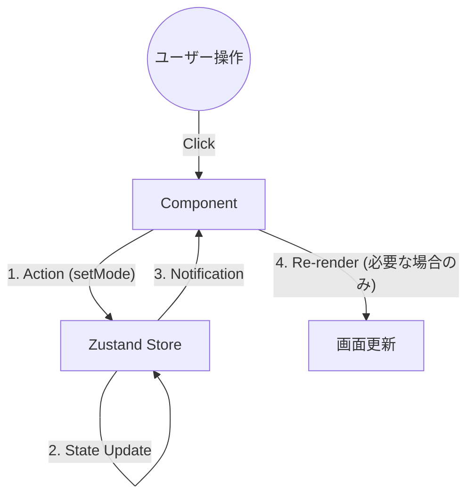
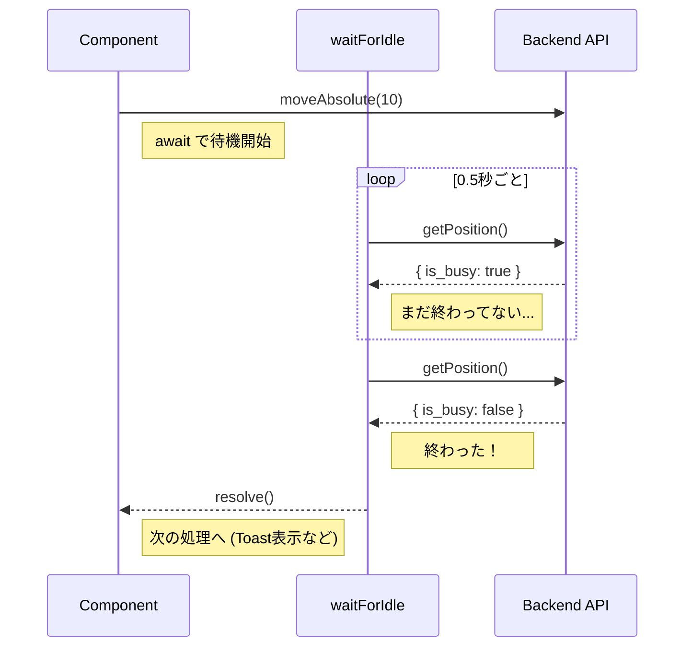

# 03. フロントエンド層 (Frontend Client)

このドキュメントでは、`src/` ディレクトリに配置されているフロントエンドアプリケーションの実装詳細について解説します。
本アプリケーションは、**React** をベースに、**Zustand** による状態管理と **TypeScript** による型安全性を組み合わせたモダンなSPA構成です。

## 1. 状態管理 (Zustand)

`src/store/useAppStore.ts`

本アプリでは、Reduxのような記述量の多いライブラリではなく、軽量でフックベースの **Zustand** を採用しています。
「巨大な変数置き場」という概念を視覚化すると以下のようになります。



### 1.1 ストア設計と最適化 (`useShallow`)

ストアは単一の巨大なオブジェクトとして管理されますが、コンポーネント側で不必要な再レンダリング（画面の描き直し）が起きないよう、**セレクタ**と `useShallow` を活用しています。

```typescript
// パフォーマンス最適化の例
const { stagePort, isStageConnected } = useAppStore(
    useShallow((state) => ({
        stagePort: state.stagePort,
        isStageConnected: state.isStageConnected,
    }))
);
```

**解説:**
1.  `useAppStore((state) => ...)`: ストア全体の中から、このコンポーネントが必要なデータだけを選び出します（セレクト）。
2.  `useShallow`: 選んだデータの中身を比較します。
    *   通常、Reactはオブジェクトが新しく作られると「データが変わった」とみなして再レンダリングします。
    *   `useShallow` を使うと、「オブジェクトの中身（`stagePort` の値など）が変わっていなければ、再レンダリングしなくていいよ」とReactに伝えます。これにより、アプリの動作が軽快になります。

### 1.2 排他制御 (`isSystemBusy`)

*   **`setIsSystemBusy(busy: boolean)`**
    *   ステージ移動中や測定シーケンス実行中に `true` に設定されます。
    *   各ボタン（移動ボタン、タブ切り替えなど）は `disabled={isSystemBusy}` のように実装されており、処理中にユーザーが誤って別の操作をするのを防ぎます。

---

## 2. APIクライアント (API Client)

`src/api/client.ts`

バックエンド（FastAPI）との通信を担うレイヤーです。`fetch` APIをラップし、共通のエラーハンドリングと型定義を提供しています。

### 2.1 ジェネリクス (`<T>`) の活用

TypeScriptの「ジェネリクス」機能を使うことで、APIが何を返してくるかを明確に定義しています。

```typescript
// request関数の定義（イメージ）
async function request<T>(endpoint: string): Promise<T> { ... }

// 使う側
const result = await request<{ status: string }>("/stage/connect");
// ここで result.status と打つと、エディタが補完してくれます。
// result.foo と打つと、「そんなプロパティはないよ」とエラーになります。
```

これにより、「サーバーから何が返ってくるかわからない」「スペルミスでバグが出る」といったHTTP通信によくある問題を未然に防いでいます。

---

## 3. UIコンポーネント実装 (Views)

### 3.1 デバイス接続画面 (`DevicesView.tsx`)

デバイスの接続・切断を管理する画面です。

*   **`useEffect` による初期化:**
    *   画面が表示された瞬間（マウント時）に一度だけAPIを呼んで、利用可能なポートやカメラのリストを取得します。
    *   `useRef(initialized)` フラグを使って、React 18のStrict Mode（開発時に2回実行される仕様）による二重リクエストを防いでいます。

### 3.2 マニュアル操作画面 (`ManualView.tsx`)

#### 非同期処理とポーリング (`waitForIdle`)

JavaScriptはシングルスレッドなので、`while(true)` のようなループを書くと画面がフリーズしてしまいます。
代わりに `setInterval` を `Promise` で包むことで、「待ち合わせ」ができるようにしています。



```typescript
const waitForIdle = async () => {
    return new Promise<void>((resolve) => {
        // 0.5秒ごとにチェックするタイマーを開始
        const interval = setInterval(async () => {
            const res = await stageApi.getPosition();
            
            // Busyでなくなったら終了
            if (!res.is_busy) {
                clearInterval(interval); // タイマー停止
                resolve(); // 待機している処理に「終わったよ」と伝える
            }
        }, 500); 
    });
}

// 使うとき
await stageApi.moveAbsolute(10); // 移動命令
await waitForIdle(); // 移動が終わるまでここで止まる（画面はフリーズしない）
toast.success("移動完了！");
```

---

## 4. 開発者向けガイド: フロントエンド技術解説

このセクションでは、Webフロントエンド開発の初心者向けに、本プロジェクトで使われている主要な技術概念を解説します。

### React Hooks (フック)

Reactでは `use...` から始まる関数（フック）を使って、コンポーネントに「機能」を組み込みます。

#### `useState`: 状態（メモリ）を持つ
```typescript
const [count, setCount] = useState(0);
```
*   `count`: 現在の値です。
*   `setCount`: 値を更新する関数です。これを使うと、Reactは画面を自動的に書き換えます（再レンダリング）。

#### `useEffect`: タイミングを制御する
「画面が表示されたとき」「データが変わったとき」などに特定の処理を実行したい場合に使います。

```typescript
// 第2引数の [] (依存配列) が重要です。
useEffect(() => {
    console.log("こんにちは");
}, []); // [] が空なら、最初の1回だけ実行されます。

useEffect(() => {
    console.log("カウントが変わりました");
}, [count]); // [count] なら、countの値が変わるたびに実行されます。
```

### TypeScript (型定義)

JavaScriptに「型（Type）」のルールを追加した言語です。
「この変数は数字しか入れちゃダメ」「この関数は文字列を返す」といったルールを先に決めておくことで、コードを書いている最中にミスを発見できます。

### Zustand (状態管理)

`useState` は一つのコンポーネント（部品）の中で使う変数ですが、アプリ全体で共有したいデータ（例：ログイン中のユーザー情報、カメラが接続されているかどうか）もあります。
それを管理するのが **Zustand** です。
「アプリ全体の巨大な変数置き場」と考えてください。どの画面からでも同じデータを読み書きできます。