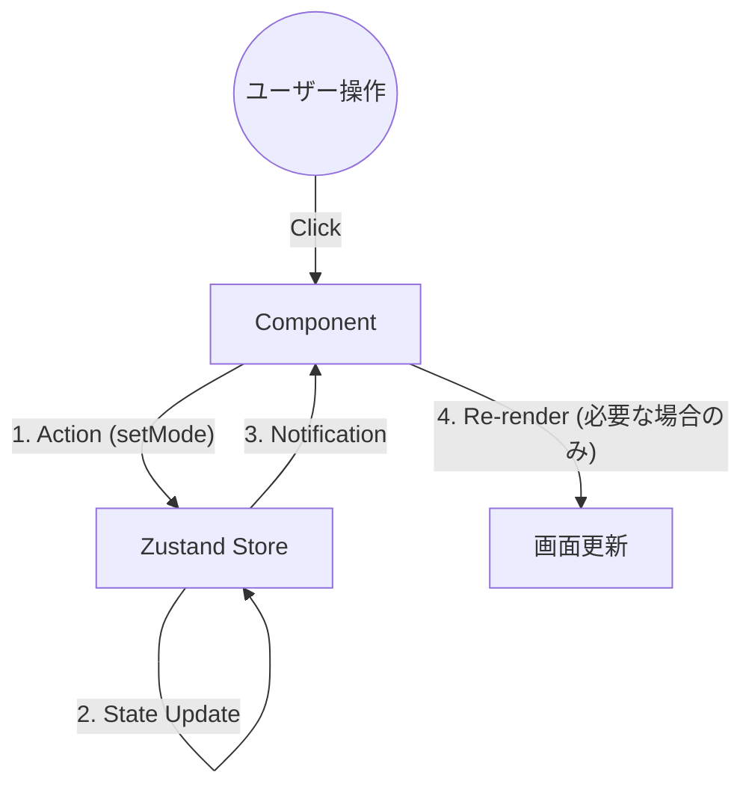
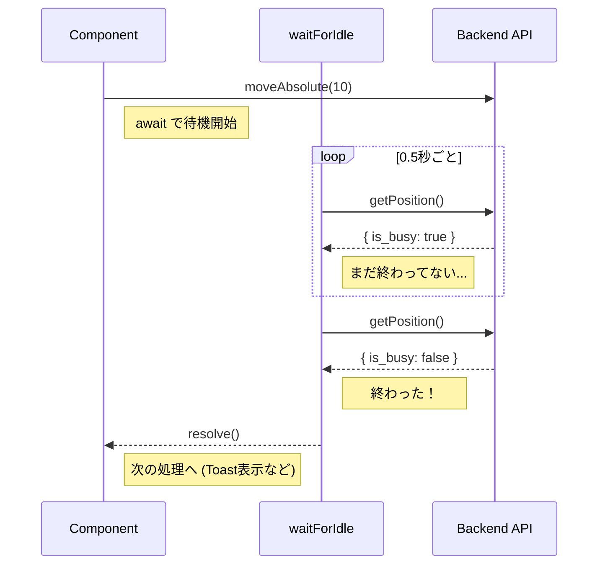

# 03. フロントエンド層 (Frontend Client)

このドキュメントでは、`src/` ディレクトリに配置されているフロントエンドアプリケーションの実装詳細について解説します。
本アプリケーションは、**React** をベースに、**Zustand** による状態管理と **TypeScript** による型安全性を組み合わせたモダンなSPA構成です。

## 1. 状態管理 (Zustand)

`src/store/useAppStore.ts`

本アプリでは、Reduxのような記述量の多いライブラリではなく、軽量でフックベースの **Zustand** を採用しています。
「巨大な変数置き場」という概念を視覚化すると以下のようになります。



### 1.1 ストア設計とパフォーマンス最適化

ストアは単一の巨大なオブジェクトとして管理されますが、高頻度で更新される状態（ステージ角度など）を扱うため、厳格な「読み取り」と「書き込み」のルールを適用しています。

#### 1. 状態の読み取り (`useShallow`)

コンポーネント側で不必要な再レンダリング（画面の描き直し）が起きないよう、**セレクタ**と `useShallow` を活用しています。

```typescript
// パフォーマンス最適化の例
const { stagePort, isStageConnected } = useAppStore(
    useShallow((state) => ({
        stagePort: state.stagePort,
        isStageConnected: state.isStageConnected,
    }))
);
```

**解説:**
1.  `useAppStore((state) => ...)`: ストア全体の中から、このコンポーネントが必要なデータだけを選び出します（セレクト）。
2.  `useShallow`: 選んだデータの中身を比較します。
    *   通常、Reactはオブジェクトが新しく作られると「データが変わった」とみなして再レンダリングします。
    *   `useShallow` を使うと、「オブジェクトの中身（`stagePort` の値など）が変わっていなければ、再レンダリングしなくていいよ」とReactに伝えます。これにより、アプリの動作が軽快になります。

#### 2. 状態の書き込み (`setState` の直接利用)
タイマーや通信のコールバックなど、Reactの画面描画ライフサイクル外で発生する状態更新には、コンポーネント内でフックを使用せず、`useAppStore.setState()` を直接呼び出します。
これにより無駄なフックの呼び出しを避け、`useEffect` の依存配列を汚さない（バグを防ぐ）設計としています。

#### 3. 一時的な値の参照 (`getState`)
`useEffect` などの非同期処理内で「現在バックエンドとつながっているか？」といったその瞬間の状態を知りたいだけの場合は、Reactの描画システムをトリガーしない `useAppStore.getState()` を使用し、最もメモリ効率の良い方法で値を取得します。

### 1.2 排他制御 (`isSystemBusy`)

*   **`setIsSystemBusy(busy: boolean)`**
    *   ステージ移動中や測定シーケンス実行中に `true` に設定されます。
    *   各ボタン（移動ボタン、タブ切り替えなど）は `disabled={isSystemBusy}` のように実装されており、処理中にユーザーが誤って別の操作をするのを防ぎます。

---

## 2. APIクライアント (API Client)

`src/api/client.ts`

バックエンド（FastAPI）との通信を担うレイヤーです。`fetch` APIをラップし、共通のエラーハンドリングと型定義を提供しています。

### 2.1 ジェネリクス (`<T>`) の活用

TypeScriptの「ジェネリクス」機能を使うことで、APIが何を返してくるかを明確に定義しています。

```typescript
// request関数の定義（イメージ）
async function request<T>(endpoint: string): Promise<T> { ... }

// 使う側
const result = await request<{ status: string }>("/stage/connect");
// ここで result.status と打つと、エディタが補完してくれます。
// result.foo と打つと、「そんなプロパティはないよ」とエラーになります。
```

これにより、「サーバーから何が返ってくるかわからない」「スペルミスでバグが出る」といったHTTP通信によくある問題を未然に防いでいます。

### 2.2 動的ベースURLの設定 (`setApiBase`)

バックエンドのポート番号は本番環境では動的に割り当てられるため、APIの接続先（ベースURL）も起動時に動的に変更する必要があります。
`client.ts` ではデフォルトの `API_BASE` を変数として保持し、`setApiBase(port)` 関数を通じて外部から接続先を書き換えられるように設計されています。
これにより、アプリ起動時にRustから受け取ったポート番号を、システム全体のAPI通信に即座に反映させることができます。

### 2.3 死活監視 (ハートビート) と自己修復

システムはバックエンドとフロントエンドの寿命の違いを吸収するため、`App.tsx` の起動シーケンスは以下の2段階で構成されています。

1.  **動的ポート取得フェーズ (ハンドシェイク):**
    *   アプリ起動直後、フロントエンドは0.5秒間隔でTauri(Rust)に「バックエンドのポート番号は決まったか？」と問い合わせを繰り返します。
    *   Rust から返答がない場合は、AppData の `backend_port.json` を読み、候補ポートに対して `/health` を 1 回だけ probe します。
    *   その probe が成功したときだけ、そのポートを採用して接続を確立します。古いヒントや壊れた JSON を掴んでも、その回では採用されません。
    *   一定時間（開発時10回=約5秒、本番時240回=約120秒）経っても返事がない場合は、開発時の手動起動とみなし、固定ポート(`14201`)へ接続を試みます（フォールバック）。
    *   この仕組みの詳細は **05. プロセス間連携と動的ポート割り当て** を参照してください。

2.  **死活監視フェーズ (ハートビート):**
    *   ポートが確定し接続先が決まると、**3秒間隔**で `/health` API を叩き続ける監視機構に移行します。
    *   **エラー検知:** 通信エラー時は即座に Zustand の `isBackendConnected` を `false` とし、UIを Offline に切り替えます。
    *   **自己修復 (Self-Healing):** バックエンドが再起動・復帰した際、自動的に最新のデバイス接続状態を再取得し、ユーザーの操作なしで完全な Ready 状態へ復元します。

### 2.4 APIクライアントのWebView互換設定 (`client.ts`)

`request()` では、Tauri WebView 環境での通信挙動を安定させるため、以下のルールを固定しています。

*   **GET/HEAD 等のボディなしリクエスト**: `Content-Type` を付与しません。
    *   不要な preflight(OPTIONS) の発生を抑え、切り分けを容易にします。
*   **ボディありリクエスト (主に POST)**: `Content-Type: application/json` を自動付与します。
*   **fetch オプション**: `mode: "cors"`, `credentials: "include"` を明示し、WebView の暗黙挙動差を減らします。

このため、`/health` のようなGET監視APIはシンプルな条件で送信されますが、ブラウザ側のセキュリティ判定で失敗した場合は `TypeError: Failed to fetch` になり得ます。

#### 補足: cross-origin 通信とは

「cross-origin 通信」は、アクセス元のページと、通信先の URL の `origin` が一致しない通信を指します。
`origin` は通常、`scheme + host + port` の組み合わせで決まります。

例:

*   `https://tauri.localhost` から `http://127.0.0.1:60371` へアクセスする
*   `tauri://localhost` から `http://127.0.0.1:60371` へアクセスする

これらは見た目はローカル通信でも、WebView から見ると「別 origin への通信」なので、CORS の許可設定が必要です。

### 2.5 バックグラウンドポーリング分離 (`useStagePolling.ts`)

ステージの角度 (`currentAngle`) など、高頻度で更新される値はReactのメイン描画サイクルに負荷をかけないよう、専用のカスタムフックに分離しています。

#### ポーリング失敗時の自動切断（フェイルセーフ）

**課題:** USB抜きなどでバックエンド通信が断絶した場合、フロントエンドのポーリングが無限にリトライし続け、エラーログが蓄積され、UIが反応不能になる可能性がありました。

**実装:**
```typescript
useMountEffect(() => {
    const pollingInterval = setInterval(async () => {
        try {
            const result = await stageApi.getStatus();
            useAppStore.setState({
                currentAngle: result.angle,
                isStageBusy: result.is_busy,
            });
        } catch (error) {
            // ★ ポーリング失敗時の自動フェイルセーフ
            console.error("Stage polling failed:", error);
            useAppStore.setState({
                isStageConnected: false,  // ← 接続状態を即座に切断
                isStageBusy: false,       // ← 移動中状態もクリア
            });
        }
    }, 100);
    return () => clearInterval(pollingInterval);
}, []);
```

**効果:**
- バックエンド通信失敗 → 即座に UI の接続状態が `false` に切り替わる
- ポーリングは継続するが、次回のポーリングで `/health` の成功を待つ（自己修復）
- エラーログの無限蓄積を防ぎ、UIの応答性を保証
`isStageConnected` が `true` の間、0.1秒(100ms)間隔で `/stage/position` をポーリングし、Zustandストアを直接 (`setState` で) 書き換え続けることで、パフォーマンスとリアルタイム性を両立しています。

---

## 3. UIコンポーネント実装 (Views)

### 3.1 ルートコンポーネントと全体制御 (`App.tsx`)

アプリケーションの骨格であり、ヘッダー、サイドバー、メイン画面の切り替え、およびシステム全体の監視を担います。

#### ヘッダーステータスバッジの動的制御
バックエンドと各デバイスの接続状態、および動作状態（Busy/Measuring）を組み合わせて、システムの状態を6段階の優先順位で評価し、直感的な色とテキストでユーザーにフィードバックします（Offline: 赤, Measuring/Moving: 黄/青, Ready: 緑, 待機: グレー）。

#### スナップショットの2段階保存フロー
カメラのスナップショット撮影（`handleSnapshot`）では、設定ファイルの `askSavePath` パラメータに応じて以下のいずれかのフローを実行します。
1. **自動保存:** バックエンドに保存を指示し、即座に完了通知を受け取る。
2. **手動保存 (Tauri連携):** バックエンドから `pending` を受け取った後、フロントエンド側で Tauri の `@tauri-apps/plugin-dialog` API を用いてネイティブの保存ダイアログを開きます。この際、ユーザーが誤った拡張子を選択しないよう、`config.json` の設定値に基づいて拡張子を強制的にロック（フィルタリング）する工夫を施しています。

#### 安全機構: デバイス切断検知と録画の自動停止
Reactの `useEffect` を用いて `isCameraConnected` と `isRecording` の状態を常時監視しています。
録画中にUSBケーブルが抜けるなどしてカメラが切断された場合、直ちに `setIsRecording(false)` を呼び出して内部状態とUIの矛盾（UI上は録画中のままになる問題）を防ぎ、ユーザーに警告トーストを表示するフェイルセーフ機構を実装しています。

### 3.2 デバイス接続画面 (`DevicesView.tsx`)

デバイスの接続・切断を管理する画面です。

*   **`useEffect` による初期化:**
    *   画面が表示された瞬間（マウント時）に一度だけAPIを呼んで、利用可能なポートやカメラのリストを取得します。
    *   `useRef(initialized)` フラグを使って、React 18のStrict Mode（開発時に2回実行される仕様）による二重リクエストを防いでいます。

### 3.3 マニュアル操作画面 (`ManualView.tsx`)

#### 非同期処理とポーリング (`waitForIdle`)

JavaScriptはシングルスレッドなので、`while(true)` のようなループを書くと画面がフリーズしてしまいます。
代わりに `setInterval` を `Promise` で包むことで、「待ち合わせ」ができるようにしています。



```typescript
const waitForIdle = async () => {
    return new Promise<void>((resolve) => {
        // 0.5秒ごとにチェックするタイマーを開始
        const interval = setInterval(async () => {
            const res = await stageApi.getPosition();
            
            // Busyでなくなったら終了
            if (!res.is_busy) {
                clearInterval(interval); // タイマー停止
                resolve(); // 待機している処理に「終わったよ」と伝える
            }
        }, 500); 
    });
}

// 使うとき
await stageApi.moveAbsolute(10); // 移動命令
await waitForIdle(); // 移動が終わるまでここで止まる（画面はフリーズしない）
toast.success("移動完了！");
```

#### Sweep機能 (連続回転測定)
指定した範囲を一定速度で回転させる機能です。

1.  **助走区間 (Approach Margin):**
    *   ステッピングモーターは台形駆動（加速→等速→減速）を行うため、指定範囲の端では速度が出ていません。
    *   測定範囲全域で「等速」を保証するため、自動的に助走区間を計算して移動範囲を拡張します。
    *   **計算式:** `Margin = (速度[deg/s] * 加速時間[s] / 2) * 1.2`

2.  **自動録画 (Auto Record):**
    *   Sweepと連動してカメラ録画を制御します。ハードウェアトリガーを使用せず、時間計算による同期を行います。
    *   **開始遅延:** 加速にかかる時間 ＋ 助走区間を通過する時間を計算し、`setTimeout` で録画開始を予約します。

3.  **速度設定とリセット:**
    *   **バリデーション:** Zod (`z.coerce.number().transform(...)`) を使用し、入力された速度を **100PPS単位** に自動補正します。
    *   **リセット:** Sweep終了後（完了・中断問わず）、手動操作の快適性を保つため、速度設定を自動的にデフォルト（高速）に戻します。

#### ポーリングとエラーハンドリング
ステージの移動完了（Busy解除）を待機するポーリング処理を強化しています。

*   **タイムアウト:** デフォルト5分（Sweep等の長時間動作に対応）。計算された所要時間に基づいて動的に延長されます。
*   **リトライ:** 一時的な通信エラーで即死しないよう、連続5回のエラーまでは許容します。

### 3.4 ログ表示パネル (LogPanel.tsx)

システム全体の動作状況を可視化するためのコンポーネントです。
`02. APIサーバー層` で解説されている通り、バックエンドは最新のログをメモリ上に保持しており、フロントエンドはそれを定期的に取得して表示します。

#### ポーリングによるリアルタイム更新

本システムでは、WebSocketのような双方向通信ではなく、実装の堅牢性と単純さを優先して **HTTPポーリング** を採用しています。
`useEffect` フック内で `setInterval` を設定し、定期的にAPIエンドポイント `/system/logs` からログリストを取得します。

#### スマート自動スクロール (Smart Auto-Scroll)

ログウィンドウの実装で最も重要なのが「スクロール制御」です。
単に「新しいログが来たら一番下にスクロールする」だけでは、ユーザーが過去のログを読もうとしてスクロールアップした瞬間に勝手に一番下に戻されてしまい、非常に使い勝手が悪くなります（**UXの阻害**）。

これを防ぐため、以下のロジックを実装しています。

1.  **位置判定:** ユーザーが現在「一番下にいるか (`isAtBottom`)」を常に監視します。
    *   `scrollHeight - (scrollTop + clientHeight) < 20` （誤差許容20px）
2.  **条件付きスクロール:** ログ更新時、`isAtBottom` が `true` の場合のみ自動スクロールを実行します。
3.  **Resume Button:** ユーザーがスクロールアップしている間は `isAtBottom` が `false` になり、自動スクロールが停止します。この時、画面上に「最新に戻るボタン」を表示し、ワンクリックで最新ログへ復帰できるようにしています。

#### ログの視覚的区別 (Visual Distinction)

ログメッセージの内容に応じて色分けを行うことで、視認性を向上させています。
特に `[MOCK]` を含むメッセージ（`[STAGE-MOCK]` や `[CAMERA-MOCK]`）は、実機動作ではないことを明確にするため、シアン色（`text-cyan-400`）でハイライト表示し、オペレーターの誤認を防ぐ実装としています。

#### 技術的な補足: DOM操作の必要性

通常、Reactは「状態 (`state`) を変えれば画面が勝手に変わる」という**宣言的**な書き方をします。
しかし、スクロール位置の制御のような「物理的な挙動」に関しては、ブラウザのDOM要素を直接操作する**命令的**な記述が必要です。
本パネルでは `useRef` を使用してこれを実現しています。（詳細は「4. 開発者向けガイド」の `useRef` の項を参照）

### 3.5 設定画面 (`SettingsView.tsx`)

アプリケーションの動作設定を管理する画面です。TauriのファイルシステムAPIを活用し、永続的な設定管理を実現しています。

#### 設定の保存と読み込み
*   **保存場所:** `BaseDirectory.AppConfig` (OS標準のアプリケーション設定フォルダ) 直下の `config.json`。
*   **使用プラグイン:** `@tauri-apps/plugin-fs`。
*   **初期化フロー:**
    1.  `useEffect` で `config.json` の存在を確認。
    2.  **存在する場合:** 内容を読み込み、フォーム (`react-hook-form`) に反映。
    3.  **存在しない場合:** OSのドキュメントフォルダパスを取得 (`@tauri-apps/api/path`) し、サブフォルダ `NanoPol` をデフォルトパスとして設定。

#### フォルダ選択と作成
*   **ダイアログ:** `@tauri-apps/plugin-dialog` の `open` APIを使用し、ネイティブのフォルダ選択ダイアログを表示。
*   **自動作成:** 「Save Settings」ボタン押下時、指定された出力フォルダが存在しない場合は `mkdir({ recursive: true })` で自動作成する親切設計。

#### セキュリティ (Capabilities)
ファイルシステムへのアクセスは `src-tauri/capabilities/default.json` で厳格に管理されています。
*   `fs:allow-appconfig-read-recursive`: 設定ファイルの読み書き用。
*   `fs:allow-home-read-recursive` / `write`: ユーザーがホームディレクトリ配下の任意の場所（ドキュメント、デスクトップ等）を保存先に指定できるようにするための権限。


---

## 4. 開発者向けガイド: フロントエンド技術解説

このセクションでは、Webフロントエンド開発の初心者向けに、本プロジェクトで使われている主要な技術概念を解説します。

### React Hooks (フック)

Reactでは `use...` から始まる関数（フック）を使って、コンポーネントに「機能」を組み込みます。

#### `useState`: 状態（メモリ）を持つ
```typescript
const [count, setCount] = useState(0);
```
*   `count`: 現在の値です。
*   `setCount`: 値を更新する関数です。これを使うと、Reactは画面を自動的に書き換えます（再レンダリング）。

#### `useEffect`: タイミングを制御する
「画面が表示されたとき」「データが変わったとき」などに特定の処理を実行したい場合に使います。

```typescript
// 第2引数の [] (依存配列) が重要です。
useEffect(() => {
    console.log("こんにちは");
}, []); // [] が空なら、最初の1回だけ実行されます。

useEffect(() => {
    console.log("カウントが変わりました");
}, [count]); // [count] なら、countの値が変わるたびに実行されます。
```

#### `useRef` と DOM操作 (命令的プログラミング)

通常、Reactは宣言的（「結果」を書く）ですが、アニメーションやスクロール位置制御など、直接ブラウザの要素（DOM）をいじる必要がある場合は `useRef` を使います。

```typescript
const scrollRef = useRef<HTMLDivElement>(null);

// ...

// 宣言的ではなく、直接命令してスクロールさせる
if (scrollRef.current) {
    scrollRef.current.scrollTop = scrollRef.current.scrollHeight;
}
```

*   **特徴:** `useState` と違い、中身を書き換えても**再レンダリング（画面更新）が起きません**。
*   **用途:**
    *   DOM要素への参照保持（スクロール、フォーカス制御など）
    *   再レンダリングさせずに値を保持したい場合（タイマーIDの保持など）

本プロジェクトの `LogPanel` では、この機能を使って「新しいログが来たら自動で下までスクロールする」という機能を実装しています。

### TypeScript (型定義)

JavaScriptに「型（Type）」のルールを追加した言語です。
「この変数は数字しか入れちゃダメ」「この関数は文字列を返す」といったルールを先に決めておくことで、コードを書いている最中にミスを発見できます。

### Zustand (状態管理)

`useState` は一つのコンポーネント（部品）の中で使う変数ですが、アプリ全体で共有したいデータ（例：ログイン中のユーザー情報、カメラが接続されているかどうか）もあります。
それを管理するのが **Zustand** です。
「アプリ全体の巨大な変数置き場」と考えてください。どの画面からでも同じデータを読み書きできます。