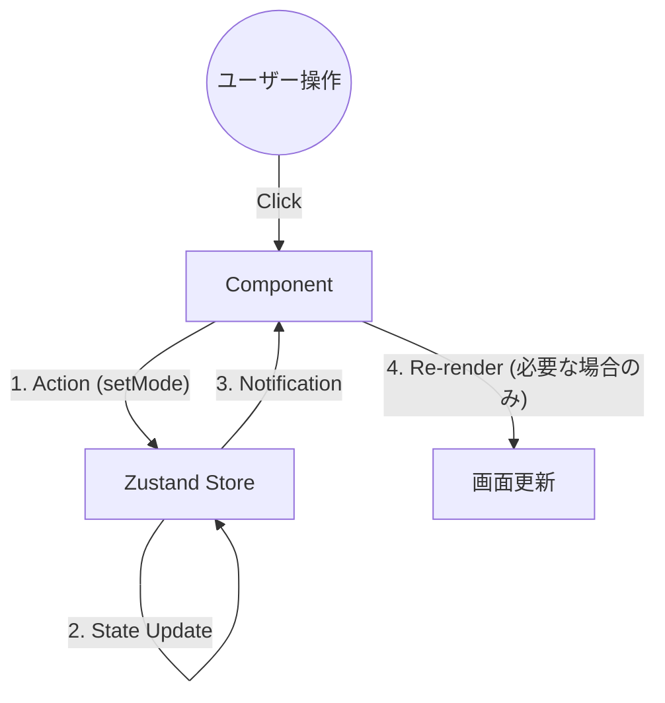
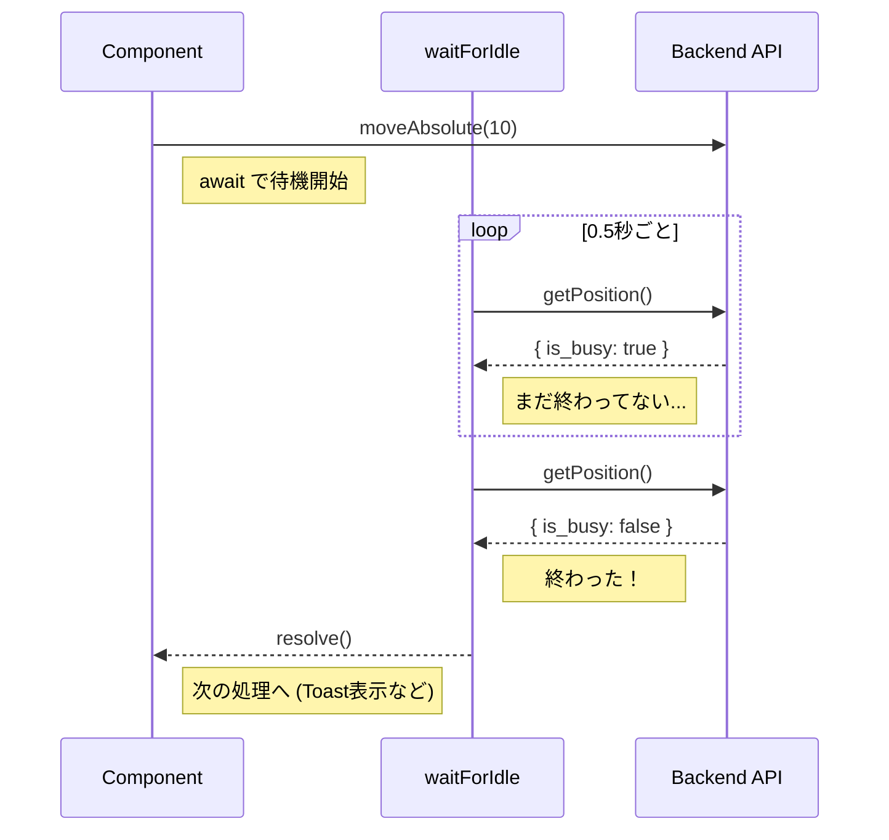

# 03. フロントエンド層 (Frontend Client)

このドキュメントでは、`src/` ディレクトリに配置されているフロントエンドアプリケーションの実装詳細について解説します。
本アプリケーションは、**React** をベースに、**Zustand** による状態管理と **TypeScript** による型安全性を組み合わせたモダンなSPA構成です。

## 1. 状態管理 (Zustand)

`src/store/useAppStore.ts`

本アプリでは、Reduxのような記述量の多いライブラリではなく、軽量でフックベースの **Zustand** を採用しています。
「巨大な変数置き場」という概念を視覚化すると以下のようになります。


```mermaid
graph TD
    User(("ユーザー操作")) -->|"Click"| UI["Component"]
    UI -->|"1. Action (setMode)"| Store["Zustand Store"]
    Store -->|"2. State Update"| Store
    Store -->|"3. Notification"| UI
    UI -->|"4. Re-render (必要な場合のみ)"| Screen["画面更新"]
```

### 1.1 ストア設計とパフォーマンス最適化

ストアは単一の巨大なオブジェクトとして管理されますが、高頻度で更新される状態（ステージ角度など）を扱うため、厳格な「読み取り」と「書き込み」のルールを適用しています。

#### 1. 状態の読み取り (`useShallow`)

コンポーネント側で不必要な再レンダリング（画面の描き直し）が起きないよう、**セレクタ**と `useShallow` を活用しています。

```typescript
// パフォーマンス最適化の例
const { stagePort, isStageConnected } = useAppStore(
    useShallow((state) => ({
        stagePort: state.stagePort,
        isStageConnected: state.isStageConnected,
    }))
);
```

**解説:**
1.  `useAppStore((state) => ...)`: ストア全体の中から、このコンポーネントが必要なデータだけを選び出します（セレクト）。
2.  `useShallow`: 選んだデータの中身を比較します。
    *   通常、Reactはオブジェクトが新しく作られると「データが変わった」とみなして再レンダリングします。
    *   `useShallow` を使うと、「オブジェクトの中身（`stagePort` の値など）が変わっていなければ、再レンダリングしなくていいよ」とReactに伝えます。これにより、アプリの動作が軽快になります。

#### 2. 状態の書き込み (`setState` の直接利用)
タイマーや通信のコールバックなど、Reactの画面描画ライフサイクル外で発生する状態更新には、コンポーネント内でフックを使用せず、`useAppStore.setState()` を直接呼び出します。
これにより無駄なフックの呼び出しを避け、`useEffect` の依存配列を汚さない（バグを防ぐ）設計としています。

#### 3. 一時的な値の参照 (`getState`)
`useEffect` などの非同期処理内で「現在バックエンドとつながっているか？」といったその瞬間の状態を知りたいだけの場合は、Reactの描画システムをトリガーしない `useAppStore.getState()` を使用し、最もメモリ効率の良い方法で値を取得します。

### 1.2 排他制御 (`isSystemBusy`)

*   **`setIsSystemBusy(busy: boolean)`**
    *   ステージ移動中や測定シーケンス実行中に `true` に設定されます。
    *   各ボタン（移動ボタン、タブ切り替えなど）は `disabled={isSystemBusy}` のように実装されており、処理中にユーザーが誤って別の操作をするのを防ぎます。

### 1.3 ステージ接続時の動的ポーリング制御（ローディング遅延の解消）

ステージコントローラが接続されている間、画面上の現在位置表示を更新するために定常的な位置ポーリング（`GET /stage/position`）を行いますが、ブロッキング通信を繰り返すとFastAPIのスレッドが枯渇し、ビュー切り替え時にカメラ画像（MJPEG）が表示され始めるまでの時間が著しく悪化（遅延）する問題が生じます。

これを防ぐため、**「動的ポーリング間隔切り替え」**を導入しています。
*   **静止時（通常時）**: ポーリング間隔を **`1000ms`** (1秒に1回) に大幅に緩和し、システム負荷を最小限に抑えます。これによりカメラストリーミング開始に必要なAPIスレッド枠が即座に確保され、ローディング遅延が解消されます。
*   **移動時（移動アクション実行中）**: ステージ移動コマンド（絶対・相対移動、原点復帰など）を発行する直前に、フロントエンド（`useStageActions` 内の `performMove`）がポーリング間隔を **`100ms`** に引き上げて滑らかな画面更新を維持し、移動完了（またはエラー終了）を検知した瞬間に速やかに `1000ms` に戻します。

### 1.4 自動測定 (Auto Mode) のワークフロー管理

Auto Mode では、単一の画面内で「サンプルの新規作成」「カテゴリ選択」「実行」という複雑な状態遷移が発生します。これを `autoPhase` という状態変数で集中管理しています。

*   **`select_session` (Session Management):**
    *   初期状態。今日の日付フォルダをスキャンし、連番での自動採番や過去の履歴表示を行います。
    *   **UI改善 (Sample Name入力):** 自動採番の挙動を前提としつつ、ユーザーが入力項目を迷わないよう、明示的なラベルと「Optional (Auto-generated if empty)」という注釈を追加しました。プレースホルダーも `Enter name or leave blank...` とすることで、未入力時のシステム動作を直感的に伝えています。
    *   **履歴表示 (Session Table) のリッチ化**: これまでの単なるフォルダ名（サンプル名）の一覧表示から、作成時刻および測定進捗（例: `2/4`）を網羅したリッチなテーブル表示にアップデートしました。これにより、一目で過去の測定状況が把握できるようになります。
    *   **日付選択 (Date Picker) の操作性向上**: カレンダーアイコン単体のトグルの代わりに、現在選択中の日付が明示された「Date Pickerボタン（例: `2026-06-19`）」を実装しました。これにより、過去の実験フォルダをロードする日付の変更操作がより直感的になりました。
*   **`select_category` (Category Selection):**
    *   セッションが確定した後の「目次」画面。新たに実装された `CategorySelector` コンポーネントがこのフェーズを担います。
    *   **用語の統一:** 以前は "Back" と呼ばれていた測定条件を、理化学的な慣例に合わせて **"Rear"** (奥) に統一しました。
    *   **UI構成:** 4つの測定カテゴリ（Left-Front, Right-Front, Left-Rear, Right-Rear）をカード形式で表示し、最新の測定履歴に基づく完了ステータスアイコンを表示します。
        *   **最新ステータス追従の原則**: 再測定時に実データと画面表示が乖離するのを防ぐため、常に「最新（末尾）の測定履歴」を評価して進捗に反映します。過去に成功（緑）していても、再測定で飽和（オレンジ）した場合は最新の状態（オレンジ）へ自動上書きされます。
        *   **正常完了 (`completed`)**: 薄い緑色の枠線と **緑色のチェックマーク** (`CheckCircle2`) を表示。
        *   **飽和警告あり (`saturated`)**: 薄いオレンジ色の枠線と **オレンジ色の「！」警告マーク** (`AlertCircle`) を表示。データ自体は存在するため進捗を完了させることは可能です。
    *   **履歴表示:** セッション内で行われた過去の全測定試行（Redoを含む）をテーブル形式で一覧表示し、実験の進捗を一目で把握できます。
*   **`measuring` (Measurement Execution):**
    *   具体的なパラメータ入力とハードウェア制御の委譲を行うフェーズ。
    *   **角度範囲プリセット (Angle Range Presets)**:
        - `MeasurementManager.tsx` の「2. Angle Range」セクションにクイック選択ボタングループ（`Standard (5°)`, `High-Res (1°)`, `Half (2°)`, `Quarter (1°)`, `Quick (15°)`）と、直下に**インライン動的説明バー**を配置。
        - **設計意図**: 開始角・終了角・ステップ角の3項目を毎回手入力する負担を軽減し、入力ミス（終了角が開始角より小さい、ステップが細かすぎて点数が爆発するなど）を防止。
        - **UI/UX設計（インライン情報バー）**: フローティングツールチップによる「上下ボタンへの覆いかぶさり・マウスイベント衝突」を根絶するため、ボタンの直下に固定の説明エリアを設置。ホバーまたは選択中のプリセットに応じて用途・点数・範囲が瞬時に切り替わるストレスフリーな操作性を実現。
        - **動作原理**: React Hook Form の `form.setValue` に `shouldValidate: true` を付与して一括更新し、即座にZodバリデーションを通過させます。また、入力値（`watchedStartAngle` 等）を監視して現在値と完全一致するプリセットをアクティブ表示し、手動入力時は自動で `Custom` 表示に切り替わるステート連動を実装しています。
    *   **Pre-Scan警告の表示とクリーンアップ**: Pre-Scanで飽和が検出されると、アライメントカード内にオレンジの警告パネル（`Saturation Warning`）を表示し、本番測定への自動移行を阻止します。本番測定が手動開始（START MEASUREMENT）されると、表示上の干渉を防ぐためアライメントの完了ステータスは即座に `"idle"` (未スキャン状態) へと自動クリアされ、画面から警告パネルが消去されます。

---

## 2. ROI (Region of Interest / 関心領域) 管理

精密な散乱光測定のため、カメラプレビュー映像上に任意の測定枠（ROI）を設定・管理する機能を実装しています。
### 2.1 座標系とスケーリングの設計

ROI管理における最大の技術的課題は、「画面上でのズームやパン操作に左右されず、常にカメラの特定の画素を指し示す」ことです。

*   **カメラ生ピクセル座標系:** 全てのROIデータ（中心座標 X, Y およびサイズ）は、カメラの撮像解像度（例: 1280x1024）に基づいた **「生ピクセル単位」** で管理されます。
*   **初期サイズと精度:** 新規作成時のROIサイズは、極小の散乱スポットを捉えやすくするため **5x5 px** をデフォルトとしています。
*   **SVGオーバーレイ描画:** 描画負荷を最小限に抑え、高倍率ズーム時でも「枠線がぼやけない」ようにするため、HTML5 Canvasではなく **SVGレイヤー** を使用しています。
    *   画像コンテナの外側に配置したSVG要素内で、現在のズーム倍率とパンオフセットを計算して描画位置を決定します。
    *   これにより、映像を50倍に拡大しても、ROIの枠線やラベルは常にシャープな1pxの線で表示されます。

### 2.2 インタラクション仕様

...

### 2.4 CameraPanel におけるプレビューレンダリングの最適化

ユーザーが画素（ピクセル）単位の正確なアライメントを行えるよう、`CameraPanel` では以下の表示最適化を組み合わせています。

1.  **高精度MJPEGストリーム:** バックエンド側でJPEG品質パラメータを **98** に設定し、圧縮によるエッジのボヤけを最小限に抑えています。
2.  **ピクセル補間制御 (`image-rendering`):**
    *   ズーム倍率が **5倍以上** になった際、CSS の `image-rendering: pixelated` を動的に適用します。
    *   これにより、ブラウザ標準のバイリニア補完（ボカし処理）が無効化され、1ピクセルが明確なタイル状として描画されるようになります。
3.  **GPUアクセラレーション:** ズームやパンの移動には CSS の `transform` を使用し、GPUによる高速な描画を促すことで、高解像度画像でも滑らかな操作感を実現しています。
4.  **アンマウント時の強制ストリーム切断 (クリーンアップ):**
    * WebView2などのブラウザエンジンにおいて、画面遷移（コンポーネントのアンマウント）時にMJPEGの接続が裏で切断されずゾンビ化して残るのを防ぐため、`useEffect` のクリーンアップ処理にて `` 要素の `src` を明示的に空（`""`）に書き換えます。これにより、ブラウザに対して通信接続を即座に破棄（Abort）するよう強制要求し、バックエンド側のスレッド枯渇やデバイスの並行アクセス競合を防止します。

---

直感的かつミスの少ない操作を実現するため、キーボード修飾キーを組み合わせた操作を採用しています。

*   **作成 (`Ctrl + Click`):** クリックした位置を中心に新規ROIを作成します。
*   **削除 (`Alt + Click`):** 既存のROIをクリックして削除します。削除時はカーソルがゴミ箱アイコンに変化し、誤操作を防ぎます。
*   **移動 (Drag):** ROI内部をドラッグすることで、生ピクセル単位で正確に移動できます。
*   **リサイズ (Handle Drag):** 右下のハンドルをドラッグしてサイズを変更します。
    *   **幾何学的拘束:** 常に正方形を維持し、かつ中心ピクセルが明確になるよう **「常に奇数ピクセル」** になるように自動補正されます。

### 2.3 カラーとインデックス管理

複数の粒子を同時に追跡・比較するため、視覚的な識別性を重視しています。

*   **最小欠番の自動割り当て:** ROIを作成する際、1〜20の中で現在空いている最小の番号が自動的に割り当てられます。
*   **高視認性カラーパレット:** 20色のカラーパレットを定義しており、特定の番号のROIは常に同じ色（例: ROI 1は常に黄色）で表示されるため、解析時の取り違えを防ぎます。
*   **リアルタイム情報パネル:** 
    *   画面右上にROIごとの座標やサイズ、簡易統計（Sum/Max）を表示するパネルを配置し、測定中の輝度飽和などを即座に監視できます。
    *   **サイズ表示**: 各ROIの現在のサイズ（ピクセル）を表示し、実験の再現性確保を支援します。

#### 【教訓】コンポーネント内のサブコンポーネント定義と再描画（ちらつき）問題
`CameraPanel` のように、0.2秒間隔のポーリングなどで頻繁に状態（State）が更新され再描画が走るコンポーネントにおいて、その関数内部で別のコンポーネント（例: `const ZoomButton = () => <button...>`）を定義すると、**再描画のたびにその子コンポーネントが破棄・再生成される**というReactの仕様（アンチパターン）に陥ります。
これにより、Hover状態やTooltipの表示状態が0.2秒ごとにリセットされ、激しい「ちらつき」が発生するバグがありました。この問題は、サブコンポーネントの定義をファイルのトップレベル（親コンポーネントの外側）に移動することで解決しています。状態更新が激しい画面を設計する際は、コンポーネントの定義場所に注意が必要です。

---

## 3. APIクライアント (API Client)

`src/api/client.ts`

バックエンド（FastAPI）との通信を担うレイヤーです。`fetch` APIをラップし、共通のエラーハンドリングと型定義を提供しています。

### 2.1 ジェネリクス (`<T>`) の活用

TypeScriptの「ジェネリクス」機能を使うことで、APIが何を返してくるかを明確に定義しています。

```typescript
// request関数の定義（イメージ）
async function request<T>(endpoint: string): Promise<T> { ... }

// 使う側
const result = await request<{ status: string }>("/stage/connect");
// ここで result.status と打つと、エディタが補完してくれます。
// result.foo と打つと、「そんなプロパティはないよ」とエラーになります。
```

これにより、「サーバーから何が返ってくるかわからない」「スペルミスでバグが出る」といったHTTP通信によくある問題を未然に防いでいます。

### 2.2 動的ベースURLの設定 (`setApiBase`)

バックエンドのポート番号は本番環境では動的に割り当てられるため、APIの接続先（ベースURL）も起動時に動的に変更する必要があります。
`client.ts` ではデフォルトの `API_BASE` を変数として保持し、`setApiBase(port)` 関数を通じて外部から接続先を書き換えられるように設計されています。
これにより、アプリ起動時にRustから受け取ったポート番号を、システム全体のAPI通信に即座に反映させることができます。

### 2.3 死活監視 (ハートビート) と自己修復

システムはバックエンドとフロントエンドの寿命の違いを吸収するため、`App.tsx` の起動シーケンスは以下の2段階で構成されています。

1.  **動的ポート取得フェーズ (ハンドシェイク):**
    *   アプリ起動直後、フロントエンドは0.5秒間隔でTauri(Rust)に「バックエンドのポート番号は決まったか？」と問い合わせを繰り返します。
    *   Rust から返答がない場合は、AppData の `backend_port.json` を読み、候補ポートに対して `/health` を 1 回だけ probe します。
    *   その probe が成功したときだけ、そのポートを採用して接続を確立します。古いヒントや壊れた JSON を掴んでも、その回では採用されません。
    *   一定時間（開発時10回=約5秒、本番時240回=約120秒）経っても返事がない場合は、開発時の手動起動とみなし、固定ポート(`14201`)へ接続を試みます（フォールバック）。
    *   この仕組みの詳細は **05. プロセス間連携と動的ポート割り当て** を参照してください。

2.  **死活監視フェーズ (ハートビート):**
    *   ポートが確定し接続先が決まると、**3秒間隔**で `/health` API を叩き続ける監視機構に移行します。
    *   **エラー検知:** 通信エラー時は即座に Zustand の `isBackendConnected` を `false` とし、UIを Offline に切り替えます。
    *   **自己修復 (Self-Healing):** バックエンドが再起動・復帰した際、自動的に最新のデバイス接続状態を再取得し、ユーザーの操作なしで完全な Ready 状態へ復元します。

### 2.4 APIクライアントのWebView互換設定 (`client.ts`)

`request()` では、Tauri WebView 環境での通信挙動を安定させるため、以下のルールを固定しています。

*   **GET/HEAD 等のボディなしリクエスト**: `Content-Type` を付与しません。
    *   不要な preflight(OPTIONS) の発生を抑え、切り分けを容易にします。
*   **ボディありリクエスト (主に POST)**: `Content-Type: application/json` を自動付与します。
*   **fetch オプション**: `mode: "cors"`, `credentials: "include"` を明示し、WebView の暗黙挙動差を減らします。

このため、`/health` のようなGET監視APIはシンプルな条件で送信されますが、ブラウザ側のセキュリティ判定で失敗した場合は `TypeError: Failed to fetch` になり得ます。

#### 補足: cross-origin 通信とは

「cross-origin 通信」は、アクセス元のページと、通信先の URL の `origin` が一致しない通信を指します。
`origin` は通常、`scheme + host + port` の組み合わせで決まります。

例:

*   `https://tauri.localhost` から `http://127.0.0.1:60371` へアクセスする
*   `tauri://localhost` から `http://127.0.0.1:60371` へアクセスする

これらは見た目はローカル通信でも、WebView から見ると「別 origin への通信」なので、CORS の許可設定が必要です。

### 2.5 自動測定API (autoApi)

自動測定のセッション管理を担うAPI群です。

*   **`getSessions()`**: 今日の日付フォルダ内の既存セッション（サンプル）一覧を取得します。
*   **`createSession(sampleName)`**: 新しいサンプルフォルダを自動採番または指定名で作成し、初期 `settings.json` を生成します。
*   **`getSessionSettings(folderPath)`**: 指定したフォルダの `settings.json` を読み込み、過去の測定履歴やROI設定を復元します。

### 2.6 バックグラウンドポーリング分離 (`useStagePolling.ts`)

ステージの角度 (`currentAngle`) など、高頻度で更新される値はReactのメイン描画サイクルに負荷をかけないよう、専用のカスタムフックに分離しています。

#### ポーリング失敗時の自動切断（フェイルセーフ）

**課題:** USB抜きなどでバックエンド通信が断絶した場合、フロントエンドのポーリングが無限にリトライし続け、エラーログが蓄積され、UIが反応不能になる可能性がありました。

**実装:**
```typescript
useMountEffect(() => {
    const pollingInterval = setInterval(async () => {
        try {
            const result = await stageApi.getStatus();
            useAppStore.setState({
                currentAngle: result.angle,
                isStageBusy: result.is_busy,
            });
        } catch (error) {
            // ★ ポーリング失敗時の自動フェイルセーフ
            console.error("Stage polling failed:", error);
            useAppStore.setState({
                isStageConnected: false,  // ← 接続状態を即座に切断
                isStageBusy: false,       // ← 移動中状態もクリア
            });
        }
    }, 100);
    return () => clearInterval(pollingInterval);
}, []);
```

**効果:**
- バックエンド通信失敗 → 即座に UI の接続状態が `false` に切り替わる
- ポーリングは継続するが、次回のポーリングで `/health` の成功を待つ（自己修復）
- エラーログの無限蓄積を防ぎ、UIの応答性を保証
`isStageConnected` が `true` の間、0.1秒(100ms)間隔で `/stage/position` をポーリングし、Zustandストアを直接 (`setState` で) 書き換え続けることで、パフォーマンスとリアルタイム性を両立しています。

### 2.7 ステージ操作の共通化 (`useStageActions.ts`)

`ManualView` と `MeasurementManager` で重複していたステージ操作ロジックを、カスタムフック `useStageActions` に集約しました。

*   **カプセル化された機能**:
    *   **移動と待機**: 移動コマンド送信後の `is_busy` 監視（ポーリング）と完了待ち。
    *   **排他制御**: `isSystemBusy` によるUIロックの自動管理。
    *   **通知とログ**: 成功・失敗・中断時のトースト通知とシステムログ送信。
    *   **基本操作**: 絶対移動、相対移動（ジョグ）、原点復帰、停止（減速/緊急）。
*   **メリット**:
    *   **保守性の向上**: ポーリング間隔やタイムアウト設定を一箇所で変更可能。
    *   **堅牢性**: どの画面からの操作でも、確実に「動作完了を待ってから次のアクションへ進む」という正しいシーケンスが保証される。

---

## 3. UIコンポーネント実装 (Views)

### 3.1 ルートコンポーネントと全体制御 (`App.tsx`)

アプリケーションの骨格であり、ヘッダー、サイドバー、メイン画面の切り替え、およびシステム全体の監視を担います。

#### ヘッダーステータスバッジの動的制御
バックエンドと各デバイスの接続状態、および動作状態（Busy/Measuring）を組み合わせて、システムの状態を6段階の優先順位で評価し、直感的な色とテキストでユーザーにフィードバックします（Offline: 赤, Measuring/Moving: 黄/青, Ready: 緑, 待機: グレー）。

#### スナップショットの2段階保存フロー
カメラのスナップショット撮影（`handleSnapshot`）では、設定ファイルの `askSavePath` パラメータに応じて以下のいずれかのフローを実行します。
1. **自動保存:** バックエンドに保存を指示し、即座に完了通知を受け取る。
2. **手動保存 (Tauri連携):** バックエンドから `pending` を受け取った後、フロントエンド側で Tauri の `@tauri-apps/plugin-dialog` API を用いてネイティブの保存ダイアログを開きます。この際、ユーザーが誤った拡張子を選択しないよう、`config.json` の設定値に基づいて拡張子を強制的にロック（フィルタリング）する工夫を施しています。

#### 安全機構: デバイス切断検知と録画の自動停止
Reactの `useEffect` を用いて `isCameraConnected` と `isRecording` の状態を常時監視しています。
録画中にUSBケーブルが抜けるなどしてカメラが切断された場合、直ちに `setIsRecording(false)` を呼び出して内部状態とUIの矛盾（UI上は録画中のままになる問題）を防ぎ、ユーザーに警告トーストを表示するフェイルセーフ機構を実装しています。

#### スクロール制御ポリシー（バウンス抑止）

画面全体のバウンススクロール（ルート要素の overscroll）を防ぎつつ、ビュー内の必要な領域だけをスクロールさせるため、グローバルCSSで以下の方針を採用しています。

*   `html`, `body`, `#root` は `height: 100%` + `overflow: hidden` + `overscroll-behavior: none`。
*   実際のスクロールは各View内コンテナ（例: `overflow-y-auto` を持つ要素）に限定する。

これにより「スクロールすべきでない領域でのバウンス挙動」を止めつつ、設定画面などの本来スクロールが必要な領域は維持できます。

### 3.2 デバイス接続画面 (`DevicesView.tsx`)

デバイスの接続・切断を管理する画面です。

*   **`useEffect` による初期化と自己修復:**
    *   以前は画面マウント時に一度だけデータ取得を行っていましたが、現在は **`isBackendConnected`（バックエンド接続済みフラグ）** を監視するリアクティブな設計に変更されています。
    *   バックエンドとの接続が確立されたタイミングで初めてポートやカメラのリストを取得するため、起動直後のフライングによるエラーを防ぎます。
    *   また、バックエンドが再起動して再接続された際にも自動的にリストが最新化される「自己修復（Self-Healing）」機能として働きます。
*   **フェイルセーフUI:**
    *   バックエンドと未接続の状態では、リフレッシュボタンやConnectボタン、ドロップダウンが自動的に無効化（disabled）され、ユーザーの誤操作によるエラーを未然に防ぎます。
*   **Tauri IPCによるOSレベルの強制リセット（Force Reset）:**
    *   **デッドロック回避**: 機器のフリーズや通信デッドロックなどで通常のHTTP APIが反応しない場合に備え、通常のHTTPリクエストではなく、TauriのIPC（Rust側）へ直接 `force_restart_backend` コマンドを送信します。
    *   **プロセスの強制再起動**: Rust側は、既存の安定したシャットダウンシーケンス（`stop_backend_sidecar`）を流用して古いPythonプロセスを確実に強制終了（Kill）し、ポートの解放を500ms待機した後に、**初回起動時のポート番号を維持したまま**同じ設定でPythonプロセスを再起動（Respawn）させます。
    *   **ポートのフォールバック解決（`resolve_backend_port`）**: 共有メモリ内のポート情報が空（`None`）の場合でも、アプリデータ内の `backend_port.json` からのJSON読み取り、およびデフォルトポート `14201` への切り替えをフォールバックとして行うため、Vite開発環境や手動起動デバッグ時であっても、ポートの不一致を起こさずに確実にリセットが実行されます。
    *   **プロセスのライフサイクル継続**: 再起動された新しい子プロセスは、再びRust側の `BackendChildState` に格納されます。これにより、再起動後にユーザーがアプリの「X」ボタンを押した際にも、新しいプロセスが漏れなく自動Killされる状態が継続保証されます。
*   **測定プロファイル (保存先プリセット) の選択と自動連動:**
    *   **UI要素**: 接続カードの直上に、プロファイル選択用ドロップダウン (`Select`) と、現在適用されている絶対パスを示す静的テキスト（編集不可）が配置されています。
    *   **画面間の責任の分離 (Browseの排除)**: パス選択の操作ミスや接続画面のUIが煩雑になるのを避けるため、フォルダを参照・選択する `[Browse]` ボタンは接続画面には配置せず、`SettingsView` に一元化しています。
    *   **Zustand ストアとの連動**: ドロップダウンでプロファイル（佐藤など）を選ぶと、グローバル状態 `activePresetId` が変更され、同時に `outputDirectory`（現在有効なパス）が自動的にそのプロファイルのパスに同期されます。
    *   **フォールバックと Custom 表示**: 
        *   「未選択 (No Preset)」を選択した場合は、設定画面で定義された「大元の基本保存先パス」へと安全にフォールバックします（ストア側で `defaultOutputDirectory` を保持しているため、切り替え前の基本デフォルトパスが失われません）。
        *   手動でプリセット外のフォルダを設定画面で指定した場合は、接続画面のドロップダウンは自動的に `Custom (手動指定 / プリセット外)` に切り替わり、オペレーターが現在の保存先が一時的なものであることを一目で把握できるように設計されています。

### 3.3 マニュアル操作画面 (`ManualView.tsx`)

#### 非同期処理とポーリング (`waitForIdle`)

JavaScriptはシングルスレッドなので、`while(true)` のようなループを書くと画面がフリーズしてしまいます。
代わりに `setInterval` を `Promise` で包むことで、「待ち合わせ」ができるようにしています。


```mermaid
sequenceDiagram
    participant UI as Component
    participant Timer as waitForIdle
    participant API as Backend API

    UI->>API: moveAbsolute(10)
    Note right of UI: await で待機開始
    
    loop 0.5秒ごと
        Timer->>API: getPosition()
        API-->>Timer: { is_busy: true }
        Note right of Timer: まだ終わってない...
    end
    
    Timer->>API: getPosition()
    API-->>Timer: { is_busy: false }
    Note right of Timer: 終わった！
    
    Timer-->>UI: resolve()
    Note right of UI: 次の処理へ (Toast表示など)
```

```typescript
const waitForIdle = async () => {
    return new Promise<void>((resolve) => {
        // 0.5秒ごとにチェックするタイマーを開始
        const interval = setInterval(async () => {
            const res = await stageApi.getPosition();
            
            // Busyでなくなったら終了
            if (!res.is_busy) {
                clearInterval(interval); // タイマー停止
                resolve(); // 待機している処理に「終わったよ」と伝える
            }
        }, 500); 
    });
}

// 使うとき
await stageApi.moveAbsolute(10); // 移動命令
await waitForIdle(); // 移動が終わるまでここで止まる（画面はフリーズしない）
toast.success("移動完了！");
```

#### Sweep機能 (連続回転測定)
指定した範囲を一定速度で回転させる機能です。

1.  **助走区間と経路計算 (Backend Delegation):**
    *   以前はフロントエンドで計算していましたが、現在はバックエンドに完全に委譲されています。
    *   バックエンドは加速時間と速度から助走区間を算出し、360度補正などを含めた安全な移動経路を自動生成します。

2.  **自動録画 (Auto Record):**
    *   **同期録画:** 録画の開始・停止のトリガー制御はバックエンドが行います。フロントエンドは `auto_record` フラグを送信するだけで、実際の録画タイミング（Start角度通過時など）の管理には関与しません。
    *   **排他制御:** 手動録画（ヘッダーからの操作）が既に進行中の場合、リソース競合を防ぐため、フロントエンド側で Sweep の開始をブロックします。

3.  **進捗表示 (Progress Polling):**
    *   `operation_id` をキーとして、バックエンドからフェーズ（approach/sweep/finalize）、進捗率、残り時間などの詳細なステータスを取得し、専用のプログレスバーに反映します。

4.  **速度設定とリセット:**
    *   **バリデーション:** Zod (`z.coerce.number().transform(...)`) を使用し、入力された速度を **100PPS単位** に自動補正します。
    *   **リセット:** Sweep終了後（完了・中断問わず）、手動操作の快適性を保つため、バックエンド側で速度設定を自動的にデフォルト（高速）に戻します。

#### ポーリングとエラーハンドリング
ステージの移動完了（Busy解除）を待機するポーリング処理を強化しています。

*   **タイムアウト:** デフォルト5分（Sweep等の長時間動作に対応）。計算された所要時間に基づいて動的に延長されます。
*   **リトライ:** 一時的な通信エラーで即死しないよう、連続5回のエラーまでは許容します。

### 3.4 自動測定画面 (AutoView.tsx)

自動測定の進行を管理する主要な画面です。

*   **フェーズ連動型UI**: ストアの `autoPhase` に基づき、左側の操作パネルを動的に切り替えます（Session Management / Category Selection / Measurement Execution）。
*   **一貫したナビゲーション**: 「Back」や「Exit」など前のフェーズへ戻る操作ボタンは、常にパネル左上に配置し、ユーザーが迷わない設計としています。
*   **Manual Remote (Joystick)**: 測定フェーズにおいて、画面を切り替えずにステージを操作できるポップオーバーを実装しました。0.1° / 1° / 5° のステップ切り替えが可能です。
*   **右側ビューパネル (Resizable)**:
    *   `shadcn/ui` の `ResizablePanelGroup` を採用。
    *   上段に `CameraPanel`、下段に `GraphPanel` (`recharts`) を配置し、映像とグラフの比率をユーザーが調整可能です。
    *   **実機環境（Windows WebView2等）における描画乱れ対策とGPU隔離の選定理由**:
        *   **現象**: Windows等の実機環境（TauriのWebView2/Chromium）において、可変の分割パネル（`ResizablePanel`）の中で高頻度に再描画される要素（カメラ画像、グラフSVG）が同居した際、描画エンジンの部分描画のフリーズ（Partial Paint Glitch）が発生し、画面全体が乱れたりポインタの移動に合わせて要素が見え隠れする不具合が確認されました。
        *   **対策**: これを根本的に防止するため、親コンテナおよび各パネルのラッパー div 要素に対して `transform: translate3d(0, 0, 0)` と `backface-visibility: hidden` を指定し、GPU上で個別の独立した合成レイヤーとして隔離させました。
        *   **`will-change` を使用しない理由**: 本来、GPUレイヤーの昇格を促す標準仕様は `will-change: transform` ですが、これを使用するとブラウザが「将来アニメーションする要素」として極めて強力なテクスチャキャッシュ（固定化）を実行するため、カメラ映像を拡大した際に最初期フレーム（サイズ0）のぼやけた画像がGPUメモリ上に固定化され、高倍率ズーム時に画素がぼやけてしまうバグが発生します。そのため、あえて古典的な無変形3Dハック（`translate3d`）を用いることで、拡大時に綺麗なピクセルで再ラスタライズを実行させつつ、パネル間の描画干渉を完全に防ぐアプローチを採用しています。
*   **ナビゲーション保護**:
    *   Pre-Scan または 本番測定の実行中は、ストアの `isMeasuring` フラグが `true` に設定されます。
    *   サイドバーのメニュー項目や設定ボタンが自動的に無効化（Disabled）され、測定中の中断や設定変更を物理的に防止します。
*   **堅牢な状態管理とエラー復帰（クリーンアップ & 強制フォールバック）**:
    *   **開始エラー時の自動復旧**: Pre-Scan または 本番測定の開始APIリクエストで例外（デバイス未接続エラーなど）が発生した場合、`catch` ブロックで `isMeasuring` および `isPrescan` フラグを即座に `false` にリセットし、UIが測定中状態のままロック（フリーズ）されるのを防止します。
    *   **強制中断時の安全フォールバック**: 測定キャンセル（`CANCEL MEASUREMENT`）処理において、APIリクエスト失敗時やポーリング監視が開始されていない（`operationId` が `null`）場合でも、`finally` 節でフロントエンド側のロックを強制解除し、安全に入力フォームへ復帰できるフォールバック機構を実装しています。
    *   **【注意】物理機器の非同期制御における設計上の注意点（通信切断時のUI乖離とフェールセーフ）**:
        > [!WARNING]
        > 上述のフォールバック処理は「UIがフリーズしたまま戻らなくなる」という画面操作上のデッドロックを防ぐための救済措置です。
        > もし測定開始直後に通信障害が発生し、キャンセルAPIの送信自体もエラー（通信失敗）になった場合、フロントエンド側はUIロックを解除して元の画面に戻りますが、バックエンド側にはキャンセル（ステージ停止）命令が届いていないため、物理的な回転ステージは回り続けてしまうという「UIと実機の乖離」が論理的に発生し得ます。
        > ハードウェア制御の安全性（物理的破壊の防止）を極限まで高めるため、今後はフロント側でのAPIエラー時の強制復帰条件の厳格化（通信成功時のみロック解除する等）や、バックエンド（Python）側での「ハートビート監視（UIからのポーリングが途絶えたらステージを自律停止させるウォッチドッグ機能）」などの二重のセーフティ機構を検討する必要があります。
    *   **Pre-Scan完了時の自動ROI同期（重心位置への枠線追従）**: 
        *   Pre-Scanが正常に終了した際、バックエンドで計算された最新の重心座標を `GET /camera/rois` から取得し、フロントエンドのストア（`rois`）を更新します（`fetchRois` アクション）。
        *   同期の際、UI固有の `id` や `color` はそのまま維持され、座標（`x`, `y`）およびサイズ（`size`）のみがバックエンドから得られた最新の値に上書きされるため、画面上の枠線が新しい重心へ自動で移動（吸着）します。
    *   **0.5ピクセルの座標齟齬の補正（PIXEL_CENTER_OFFSET）**: 
        *   画像処理の基準座標系（ピクセルの中心が整数値で、左端が `-0.5`）と、画面上のコンテナ座標系（左端が `0.0`、中心が `0.5`）の間の原点のズレを解消するため、入力時と描画時に `PIXEL_CENTER_OFFSET` (定数値 `0.5`) を用いた補正を行います。
        *   *入力時（`screenToImage`）*: `raw_coordinate - PIXEL_CENTER_OFFSET`
        *   *描画時（SVG）*: `(store_coordinate + PIXEL_CENTER_OFFSET) * scale`
    *   **カメラ接続時の物理解像度の動的同期**:
        *   カメラ接続API（`POST /camera/connect`）のレスポンスから、接続されたカメラの実際の物理寸法（`width`, `height`）をフロントエンドで受信し、ストア内の `cameraResolution` 状態を動的に同期します。
        *   これにより、実機の解像度（アスペクト比）とフロントエンド側の画像表示コンテナのアスペクト比が完全に一致し、比率の齟齬による画像の黒帯余白に起因するROIの描画位置ズレを $100\%$ 回避します。
    *   **高倍率ズーム時の描画改善とピクセル鮮明化**:
        *   *境界線干渉の排除 (`outline` への変更)*: 画像コンテナ（`imageContainerRef`）の `border`（1px）を廃止し、レイアウト計算に影響を与えない `outline` と `outlineOffset` に変更しました。これにより、枠線がコンテナサイズ計算（アスペクト比）に干渉するのを防ぎ、高倍率ズーム時のピクセル単位の枠ズレを解消しました。
        *   *ズームぼやけ対策 (`will-change` の削除と遅延マウント)*: 画像コンテナから `will-change-transform` を削除しました（指定されていると、ブラウザが初回ロード時の低解像度テクスチャをGPUに固定化し、拡大時にぼやけた画像を引き伸ばすため）。また、コンテナの物理サイズ（`containerSize`）が決定した後に `` タグをマウントする条件付きレンダリングを採用しました。これにより、サイズ0での読み込みによるテクスチャぼやけを防ぎ、最初の接続時からズーム時にピクセル一つ一つが完全に鮮明に描写されるようになりました。


### 3.5 リアルタイムグラフパネル (GraphPanel.tsx)

自動測定中の各種統計データを可視化するためのコンポーネントです。

*   **マルチモード表示**:
    *   **Intensity (Sum)**: 解析のメインデータ（合計輝度）。
    *   **Saturation (Max)**: 飽和確認用（最大輝度）。Pre-Scan時のデフォルト。
    *   **Center Pixel**: ROI中心ピクセルの生の輝度値。
    *   **Stability (Drift)**: 基準位置からの移動距離（$\sqrt{\Delta x^2 + \Delta y^2}$）。
*   **視認性へのこだわり**:
    *   **ダーク固定背景**: ライトモード時でも背景をダークグレー (`bg-zinc-800`) に固定し、黄色やシアンのROIカラーを鮮明に表示します。
    *   **直線補間 (Linear)**: 測定機器としての正確性を重視し、点間を滑らかな曲線ではなく直線で結びます。
    *   **グラスモーフィズム**: ツールチップに「リキッドグラス」風の透過・ぼかし効果を適用し、背後のグラフを隠さない洗練されたUIを実現しています。

### 3.6 ログ表示パネル (LogPanel.tsx)

システム全体の動作状況を可視化するためのコンポーネントです。
`02. APIサーバー層` で解説されている通り、バックエンドは最新のログをメモリ上に保持しており、フロントエンドはそれを定期的に取得して表示します。

#### ポーリングによるリアルタイム更新

本システムでは、WebSocketのような双方向通信ではなく、実装の堅牢性と単純さを優先して **HTTPポーリング** を採用しています。
`useEffect` フック内で `setInterval` を設定し、定期的にAPIエンドポイント `/system/logs` からログリストを取得します。

#### スマート自動スクロール (Smart Auto-Scroll)

ログウィンドウの実装で最も重要なのが「スクロール制御」です。
単に「新しいログが来たら一番下にスクロールする」だけでは、ユーザーが過去のログを読もうとしてスクロールアップした瞬間に勝手に一番下に戻されてしまい、非常に使い勝手が悪くなります（**UXの阻害**）。

これを防ぐため、以下のロジックを実装しています。

1.  **位置判定:** ユーザーが現在「一番下にいるか (`isAtBottom`)」を常に監視します。
    *   `scrollHeight - (scrollTop + clientHeight) < 20` （誤差許容20px）
2.  **条件付きスクロール:** ログ更新時、`isAtBottom` が `true` の場合のみ自動スクロールを実行します。
3.  **Resume Button:** ユーザーがスクロールアップしている間は `isAtBottom` が `false` になり、自動スクロールが停止します。この時、画面上に「最新に戻るボタン」を表示し、ワンクリックで最新ログへ復帰できるようにしています。

#### ログの視覚的区別 (Visual Distinction)

ログメッセージの内容に応じて色分けを行うことで、視認性を向上させています。
特に `[MOCK]` を含むメッセージ（`[STAGE-MOCK]` や `[CAMERA-MOCK]`）は、実機動作ではないことを明確にするため、シアン色（`text-cyan-400`）でハイライト表示し、オペレーターの誤認を防ぐ実装としています。

#### 技術的な補足: DOM操作の必要性

通常、Reactは「状態 (`state`) を変えれば画面が勝手に変わる」という**宣言的**な書き方をします。
しかし、スクロール位置の制御のような「物理的な挙動」に関しては、ブラウザのDOM要素を直接操作する**命令的**な記述が必要です。
本パネルでは `useRef` を使用してこれを実現しています。（詳細は「4. 開発者向けガイド」の `useRef` の項を参照）

### 3.6 設定画面 (`SettingsView.tsx`)

アプリケーションの動作設定を管理する画面です。TauriのファイルシステムAPIを活用し、永続的な設定管理を実現しています。

#### 左右分割（サイドバー付き）UI構成へのリニューアル
画面の左側にカテゴリ選択サイドバー、右側にそのカテゴリに応じた設定項目を表示する、左右分割レイアウト（`ManualView` や `AutoView` と統一されたスタイル）にリニューアルしました。
*   **左側サイドバー:** `File & Storage`, `Hardware`, `Measurement` の3つのカテゴリ切り替えボタンを配置。
*   **右側コンテンツエリア:** 選択されたカテゴリに対応する設定項目（カード形式）を動的に切り替えて表示。
    *   **Hardware カテゴリの構成（接続前提の最優先表示）:**
        デバイスの接続設定と調整用パラメータを論理的に整理するため、以下の3枚の独立したカード構造で構成し、上から順に表示します。
        1. **Device Connection Defaults**（デフォルトステージCOMポート設定）※前提条件として最上部に配置
        2. **Camera Initialization**（カメラの動作初期設定：カラーモード、露出、ゲイン）
        3. **Stage Motion Profile**（ステージの物理運動特性：最小/最大速度、加減速時間）

#### カテゴリ切り替えの状態管理とReactフックのルール（重要）
現在のアクティブなカテゴリ（`activeCategory`）は `useState` フックを用いて管理しています。

*   **Rules of Hooks（フックのルール）への適合:**
    Reactフックは、**コンポーネントのトップレベル（かつ、あらゆる早期リターンよりも前）で呼び出されなければならない**という厳格なルール（Rules of Hooks）があります。
    
    本画面の初期ロード時にローディングスピナーを返す以下の早期リターン処理があります。
    ```typescript
    if (isLoading && !form.getValues("outputDirectory")) {
      return (
        <div className="flex h-full items-center justify-center">
          <Loader2 className="h-8 w-8 animate-spin" />
        </div>
      );
    }
    ```
    `activeCategory` の `useState` 定義をこの早期リターン処理の後ろに配置してしまうと、初期ロード中（`isLoading` が `true`）はフックが呼び出されず、ロード完了後（`isLoading` が `false`）に初めて呼び出されることになります。これは、レンダリングごとにフックの呼び出し順序や回数が変化することを禁止するReactの仕様に反するため、マウント時に画面が真っ白になってクラッシュ（アンマウント）する原因になります。
    
    これを防ぐため、`activeCategory` の定義はコンポーネント内の最上部（早期リターンの前）に配置し、常に一定の順序でフックが評価されるように実装しています。

#### 設定の保存と読み込み
*   **保存場所:** `BaseDirectory.AppConfig` (OS標準のアプリケーション設定フォルダ) 直下の `config.json`。
*   **使用プラグイン:** `@tauri-apps/plugin-fs`。
*   **初期化フロー:**
    1.  `useEffect` で `config.json` の存在を確認。
    2.  **存在する場合:** 内容を読み込み、フォーム (`react-hook-form`) に反映。
    3.  **存在しない場合:** OSのドキュメントフォルダパスを取得 (`@tauri-apps/api/path`) し、サブフォルダ `NanoPol` をデフォルトパスとして設定。

#### フォルダ選択と作成
*   **ダイアログ:** `@tauri-apps/plugin-dialog` の `open` APIを使用し、ネイティブのフォルダ選択ダイアログを表示。
*   **自動作成:** 「Save Settings」ボタン押下時、指定された出力フォルダが存在しない場合は `mkdir({ recursive: true })` で自動作成する親切設計。

#### セキュリティ (Capabilities)
ファイルシステムへのアクセスは `src-tauri/capabilities/default.json` で厳格に管理されています。
*   `fs:allow-appconfig-read-recursive`: 設定ファイルの読み書き用。
*   `fs:allow-home-read-recursive` / `write`: ユーザーがホームディレクトリ配下の任意の場所（ドキュメント、デスクトップ等）を保存先に指定できるようにするための権限。

#### デフォルトCOMポートの永続化と自動選択
*   **初期値の安全性:** デフォルト値は `""` (空文字列) に設定されています。初回起動時など、設定が未登録の段階で誤ったポートが勝手に選択されるのを防ぐためです。

#### 保存先プロファイルプリセット（Storage Profile Presets）の管理
*   **`useFieldArray` による動的配列バインド**:
    *   React Hook Form の `useFieldArray` フックを使用して、設定スキーマ内のプロファイル配列（`outputPresets`）を動的に操作します。これにより、オブジェクト配列の動的な追加・削除・編集機能が、Zod によるスキーマバリデーション（空のプロファイル名の拒否や、パス未設定のガード）と型安全に統合されます。
    *   フォームの `handleSubmit` を通過した段階でバリデーション済みの安全な配列が渡されるため、ファイル書き出し時に不整合が発生しません。
*   **UUID による一意なキー管理と安全フォールバック**:
    *   プロファイルの新規追加時には `crypto.randomUUID()`（またはブラウザ/OS環境のフォールバック乱数生成）で一意なIDを生成し、これを `key` プロパティとしてReactのレンダリングに割り当てることで、リストの並び替えや削除時に状態が他の行に漏れ出すバグ（インデックスを key にした際の典型的なバグ）を防ぎます。
*   **基準デフォルトパス（`defaultOutputDirectory`）と有効パス（`outputDirectory`）の分離バインドと同期仕様**:
    *   **設計の意図と課題解決**: プロファイル選択を解除した際のフォールバック先として機能する「基準デフォルトパス」が、プロファイルの選択や手動での一時的なパス上書きによって破壊されてしまうのを防ぐため、`defaultOutputDirectory` (大元の基準パス) と `outputDirectory` (現在有効なパス) をデータスキーマおよび config.json 上で完全に分離管理します。
    *   **設定画面 (SettingsView) の役割**: 最上部の「Output Directory」入力欄および `[Browse]` ボタンは、大元の基準デフォルトパスである `defaultOutputDirectory` にのみバインドされます。これにより、プロファイルが適用された状態であっても、大元のマスタとなる基準保存先を安全に編集・永続化できます。
    *   **セーブ時の自動解決**: 設定保存時、現在のアクティブプロファイルID（`activePresetId`）を評価し、プロファイルが適用されていればそのプロファイルパスを、適用されていなければ基準デフォルトパスを `outputDirectory` に代入して `config.json` に書き込みます。
    *   **起動時・保存後の双方向同期**: 起動時や保存完了時には、Zustand ストアの各ステートへ `defaultOutputDirectory`、`outputDirectory`、`outputPresets`、および `activePresetId` を安全にディスパッチ・同期し、接続画面 (DevicesView) 側でのプロファイルドロップダウンの表示更新（手動指定時の `"__custom__"` 自動切り替えや、プロファイル未選択時の基準デフォルトパス復元）に連動させます。

*   **自動選択フロー:**
    1.  起動時に `config.json` をロードし、`defaultStagePort` が存在する場合はグローバルストアにその値を反映します。
    2.  デバイス接続画面でCOMポート一覧を取得した際（`fetchPorts`）、現在の選択ポートが未選択で、かつロードされたデフォルトポート（例: `COM5`）が検出ポート一覧の中に含まれている場合、自動的にそのポートが初期選択肢としてセットされます。
    3.  これにより、ユーザーが一度設定画面でポートを指定すれば、次回からケーブルが正しく接続されている限り「起動してそのままConnectを押すだけ」の最小ステップで接続可能になります。

---

## 4. 開発者向けガイド: フロントエンド技術解説

このセクションでは、Webフロントエンド開発の初心者向けに、本プロジェクトで使われている主要な技術概念を解説します。

### React Hooks (フック)

Reactでは `use...` から始まる関数（フック）を使って、コンポーネントに「機能」を組み込みます。

#### `useState`: 状態（メモリ）を持つ
```typescript
const [count, setCount] = useState(0);
```
*   `count`: 現在の値です。
*   `setCount`: 値を更新する関数です。これを使うと、Reactは画面を自動的に書き換えます（再レンダリング）。

#### `useEffect`: タイミングを制御する
「画面が表示されたとき」「データが変わったとき」などに特定の処理を実行したい場合に使います。

```typescript
// 第2引数の [] (依存配列) が重要です。
useEffect(() => {
    console.log("こんにちは");
}, []); // [] が空なら、最初の1回だけ実行されます。

useEffect(() => {
    console.log("カウントが変わりました");
}, [count]); // [count] なら、countの値が変わるたびに実行されます。
```

#### `useRef` と DOM操作 (命令的プログラミング)

通常、Reactは宣言的（「結果」を書く）ですが、アニメーションやスクロール位置制御など、直接ブラウザの要素（DOM）をいじる必要がある場合は `useRef` を使います。

```typescript
const scrollRef = useRef<HTMLDivElement>(null);

// ...

// 宣言的ではなく、直接命令してスクロールさせる
if (scrollRef.current) {
    scrollRef.current.scrollTop = scrollRef.current.scrollHeight;
}
```

*   **特徴:** `useState` と違い、中身を書き換えても**再レンダリング（画面更新）が起きません**。
*   **用途:**
    *   DOM要素への参照保持（スクロール、フォーカス制御など）
    *   再レンダリングさせずに値を保持したい場合（タイマーIDの保持など）

本プロジェクトの `LogPanel` では、この機能を使って「新しいログが来たら自動で下までスクロールする」という機能を実装しています。

### TypeScript (型定義)

JavaScriptに「型（Type）」のルールを追加した言語です。
「この変数は数字しか入れちゃダメ」「この関数は文字列を返す」といったルールを先に決めておくことで、コードを書いている最中にミスを発見できます。

### Zustand (状態管理)

`useState` は一つのコンポーネント（部品）の中で使う変数ですが、アプリ全体で共有したいデータ（例：ログイン中のユーザー情報、カメラが接続されているかどうか）もあります。
それを管理するのが **Zustand** です。
「アプリ全体の巨大な変数置き場」と考えてください。どの画面からでも同じデータを読み書きできます。

### 1.5 自動復帰（自己修復・オートリカバリー）ステータスの同期とUI連動

デバイスがエラーによる自己修復や自動接続を実行している際、画面のステータス表示がチカチカ変化したり、ユーザーが手動で接続操作を重ねて競合したりするのを防ぐため、以下の連動仕様が実装されています。

#### 1.5.1 ストア状態 (Zustand)
`useAppStore` 内に以下のステートが定義されています。
*   `isCameraHealing: boolean` (カメラ自動修復中フラグ)
*   `cameraReconnectAttempt: number` (カメラ自動再接続試行回数)
*   `isStageHealing: boolean` (ステージ自動修復中フラグ)

#### 1.5.2 生存監視（App.tsx）でのマッピング
*   `checkSystemHealth` 関数（3秒間隔）が `/health` から取得した `camera_is_healing`、`camera_reconnect_attempt`、`stage_is_healing` を、Zustand ストアの状態に即座にマッピング（同期）します。
*   バックエンドがオフラインになった場合は、これらの修復フラグはすべて安全に `false` / `0` にリセットされます。

#### 1.5.3 接続画面（DevicesView.tsx）での表示制御
*   **警告バッジの表示:** `isCameraHealing` / `isStageHealing` が `true` の間、ステータスバッジがオレンジ色の警告表示（パルス点滅アニメーション `animate-pulse`）に切り替わり、「Healing (X/5)」や「Restoring...」のように進行状況がユーザーに可視化されます。
*   **重複操作の防止:** 修復（再接続）が走行している間は、接続ボタン（Connect）、ポート選択ドロップダウン（Select）、および接続リストのリフレッシュボタンがすべて `disabled=true` に無効化され、重複接続によるクラッシュが未然に防止されます。

### 1.6 設定画面の未保存データ保護（Navigation Guard ＆ AlertDialog）

ユーザーが `SettingsView` で設定を変更している途中に、誤ってサイドバーをクリックして画面を離脱し、未保存のデータが破棄される事故を防ぐため、Navigation Guard 機構が実装されています。

#### 1.6.1 状態検知と同期 (`isDirty`)
*   `SettingsView.tsx` 内で React Hook Form の `form.formState.isDirty` を監視し、`useEffect` 経由でグローバルストア（`useAppStore`）の `isSettingsDirty: boolean` へリアルタイム同期します。
*   設定画面から離脱（アンマウント）する際、または「Save Settings」成功時（`form.reset(data)` 実行時）には、未保存フラグが自動的に `false` へ安全にリセットされます。

#### 1.6.2 フッター操作ボタンの活性制御
*   **Restore Defaults (初期設定復元ボタン):**
    - フッターの左端に配置（誤操作防止）。クリックするとシステム標準の推奨設定（`DEFAULT_SETTINGS`）がフォームに一括適用され、`isDirty = true`（保存ボタンが点灯）となります。即時ディスク保存は行わず、画面上で初期値を確認した上で「Save Settings」を押して保存する安全設計です。
*   **Discard Changes (変更取り消しボタン):**
    - `disabled={!isDirty || isLoading}` を適用。未保存の変更が存在するときのみ有効化され、クリックすると最後に保存された `config.json` の状態へ瞬時に復元されます。
*   **Save Settings (保存ボタン):**
    - `disabled={!isDirty || isLoading}` を適用。初期状態や未編集時はグレーアウトされ、未保存の変更があるときのみ保存実行が可能となります。保存完了後は即座に無効化状態に戻り、保存完了の安心感をフィードバックします。

#### 1.6.3 サイドバー遷移のインターセプト (`AppSidebar.tsx` ＆ `AlertDialog`)
*   サイドバーのナビゲーションボタン（`handleNavClick`）がクリックされた際、現在が `settings` 画面かつ `isSettingsDirty === true` の場合、即座の画面遷移をブロックします。
*   遷移先モードを `pendingNavigationMode` に一時退避し、shadcn/ui の **`AlertDialog`**（WAI-ARIA `role="alertdialog"` 準拠の確認ダイアログ）をポップアップ表示します。
    *   **「Discard & Leave」選択時:** `isSettingsDirty` をリセットした上で保留先のモードへ遷移を実行。
    *   **「Stay on Settings」選択時:** `pendingNavigationMode` をクリアしてダイアログを閉じ、設定画面での編集を継続。