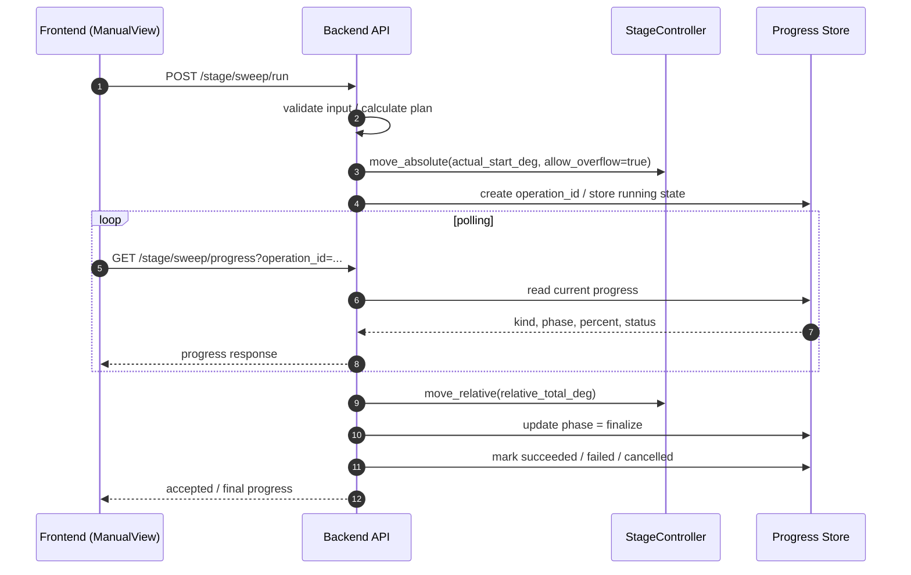
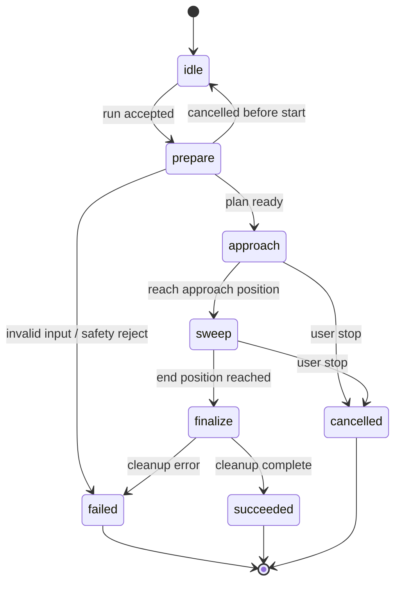

# 仕様書: Sweep 実行・進捗管理仕様 (Sweep Operation Spec)

## 1. 概要
本仕様は、Manual Mode における Sweep（連続回転測定）の実行フロー、助走位置の正規化、進捗管理、およびフロントエンドとの連携方法を定義する。

本機能の主目的は、以下の3点である。

- Sweep を安定して実行できること。
- 負方向 Sweep や原点付近の Sweep でも、助走が負の角度へ落ちないように補正すること。
- フロントエンドが進捗を正しく表示できるように、実行状態を識別可能な形で返すこと。

## 2. 設計方針

### 2.1 責務分離

- **フロントエンド:** 入力、開始ボタン、キャンセルボタン、プログレスバー表示。開始時に `auto_record` フラグをバックエンドに送るが、実際の録画の開始・停止（トリガー）は制御しない。
- **バックエンド:** Sweep 計画の算出、助走の正規化、原点越え判定、実行、進捗状態の保持。および `auto_record` が True の場合のカメラ録画の同期制御（正確な Start/End タイミングでの記録）。

助走距離や終端補正の判断、および録画の正確な同期は、画面ロジックではなくバックエンドで一元管理する。

### 2.2 実行単位

Sweep は 1 回の実行を 1 つの operation として扱う。

- 1 回の Sweep 開始で 1 つの `operation_id` を発行する。
- 進捗 API はこの `operation_id` を使って対象の Sweep を識別する。
- 将来、Step/Home/Pre-scan 等を追加する場合も、同じ枠組みを流用できる。

### 2.3 確認画面について

本仕様では確認画面は必須としない。
フロントエンドは開始前に計画確認を要求せず、そのまま `run` を呼び出してよい。

## 3. API 概要

### 3.1 Sweep 実行 API

- **Method:** `POST`
- **Path:** `/stage/sweep/run`

### 3.2 Sweep 進捗 API

- **Method:** `GET`
- **Path:** `/stage/sweep/progress`

## 4. シーケンス図



## 5. 状態遷移図



## 4. Sweep 実行 API 仕様

### 4.1 Request Body

```json
{
  "start_deg": 10.0,
  "end_deg": 80.0,
  "speed_deg_s": 15.0,
  "auto_record": false
}
```

#### フィールド

- `start_deg`:
  - Sweep 開始角度。
  - 単位は度。
- `end_deg`:
  - Sweep 終了角度。
  - 単位は度。
- `speed_deg_s`:
  - Sweep 速度。
  - 単位は deg/s。
- `auto_record`:
  - Sweep 中の自動録画を行うかどうか。
  - ただし本仕様では録画フローの詳細は扱わず、将来拡張用のフラグとして保持する。

### 3.1 バリデーションと事前計算 (API 層)

フロントエンドからのリクエスト (`start_deg`, `end_deg`, `speed_deg_s`, `auto_record`) を受け取った際、以下の処理を行います。

*   **時間制約バリデーション**:
    *   指定された角度と速度から想定されるスイープ時間が **0.2秒未満** の場合は、カメラの録画ファイル破損を防ぐため、HTTP 400 エラーでリクエストを拒否します。
*   **速度の正規化**:
    *   ユーザー指定速度 (`deg/s`) をステージの分解能 (`PPS`) に変換し、安全な範囲 (`min_pps` 〜 `max_pps`) にクランプします。
*   **助走区間 (Margin) の計算**:
    *   指定速度に到達するまでの加減速時間 (`accel_time_ms`) から必要な距離を算出し、安全マージン（1.2倍等）を加えた `margin_deg` を決定します。
*   **絶対座標系の正規化とトリガー同期**:
    *   `start_deg` からマージンを引いた `actual_start_deg`（助走開始位置）が負の値になる場合、ハードウェア制約（負パルス禁止）を避けるため、経路全体に 360度を加算します。
    *   **重要**: この際、録画の開始・停止を判定するための `trigger_start_deg` と `trigger_end_deg` にも**全く同じオフセット（360度の倍数）を加算**し、移動座標系と判定座標系を完全に同期させます。

### 3.2 非同期実行シーケンス (ワーカー層)

`_run_sweep_operation` スレッドによる実行手順は以下の通りです。

1.  **録画の事前準備 (auto_record=True の場合)**:
    *   ファイル I/O のフリーズによるメインシーケンスの遅延を防ぐため、別スレッドで `camera.prepare_recording()` を実行し、TIFF ファイルと CSV ファイルを事前に作成・オープン（スタンバイ状態）します。
2.  **助走位置への移動 (Approach)**:
    *   `move_absolute(actual_start_deg)` を実行し、監視ポーリングの遅延を回避するため、直ちに `app_state.is_busy = True` を強制設定します。その後、移動完了（`is_busy = False`）までポーリング待機します。
3.  **スイープ本番の実行 (Sweep)**:
    *   `move_relative(actual_end_deg - actual_start_deg)` を実行し、直ちに `app_state.is_busy = True` を強制設定して、一気に終端位置まで移動させます。
    *   再び `is_busy = True` になるのを待機した後、高速な監視ループに入ります。
4.  **高速監視と録画トリガー**:
    *   移動中、バックグラウンドのモニタータスク（100ms周期）が更新する `app_state.current_angle` を 10ms 間隔で監視します。
    *   角度が `trigger_start_deg` を超えた瞬間に `camera.trigger_recording()` を呼び出し、即座に録画を開始します。
    *   角度が `trigger_end_deg` を超えた瞬間に `camera.stop_recording()` を呼び出し、録画を終了します。
5.  **フェイルセーフと後処理**:
    *   移動が完了しても録画が停止していない場合は、安全のために強制的に `stop_recording()` を実行します（二重呼び出しは防止されます）。
    *   ステージの速度設定を通常の待機速度に戻し、終了状態（`succeeded`）をセットします。

### 4.3 正規化ルール

Sweep の正規化は、フロントではなくバックエンドで行う。

#### 方向判定

- `end_deg >= start_deg` の場合: 正方向 Sweep。
- `end_deg < start_deg` の場合: 負方向 Sweep。

#### 助走位置の算出

- 正方向 Sweep の場合:
  - `actual_start_deg = start_deg - margin`
  - `actual_end_deg = end_deg + margin`
- 負方向 Sweep の場合:
  - `actual_start_deg = start_deg + margin`
  - `actual_end_deg = end_deg - margin`

#### 360度補正

- `actual_start_deg` または `actual_end_deg` が負になった場合、両方に `360` 度を加算する。
- 片方だけを補正しない。
- これにより、負方向 Sweep でも end が origin 未満に落ちることを防ぐ。

### 4.4 Response Body

```json
{
  "status": "accepted",
  "operation_id": "sweep_20260601_0001",
  "plan": {
    "kind": "sweep",
    "input_start_deg": 10.0,
    "input_end_deg": 80.0,
    "actual_start_deg": 7.5,
    "actual_end_deg": 82.5,
    "relative_total_deg": 75.0,
    "direction": "forward",
    "wrapped_by_360": false,
    "estimated_approach_ms": 1200,
    "estimated_sweep_ms": 5000,
    "requested_speed_deg_s": 15.0,
    "actual_speed_deg_s": 15.0,
    "requested_speed_pps": 6000,
    "safe_speed_pps": 6000,
    "current_angle_at_request": 0.0,
    "margin_deg": 2.5
  }
}
```

#### フィールド

- `status`:
  - `accepted` を返す。
- `operation_id`:
  - この Sweep 実行を一意に識別するID。
- `plan`:
  - 実行に使った計画情報。
  - フロントエンドはこれをプログレス表示やログ表示に利用できる。
- `kind`:
  - 操作種別。Sweep 固定で `sweep` とする。
- `input_start_deg` / `input_end_deg`:
  - ユーザー入力そのままの値。
- `actual_start_deg` / `actual_end_deg`:
  - 助走込みの正規化後の値。
- `relative_total_deg`:
  - 実際に相対移動する総角度。
- `direction`:
  - `forward` または `reverse`。
- `wrapped_by_360`:
  - 360 度補正を行ったかどうか。
- `estimated_approach_ms` / `estimated_sweep_ms`:
  - 進捗表示用の概算時間。
- `requested_speed_deg_s` / `actual_speed_deg_s`:
  - ユーザーが要求した速度と、丸め処理等を経て実際に適用される速度 (deg/s)。
- `requested_speed_pps` / `safe_speed_pps`:
  - 要求速度をパルス換算した値と、ハードウェアの最小/最大制限に収めた安全なパルス速度 (PPS)。
- `current_angle_at_request`:
  - リクエストを受け付けた瞬間の現在角度。
- `margin_deg`:
  - 計算された助走区間（マージン）の角度。

## 5. Sweep 進捗 API 仕様

### 5.1 Request

```http
GET /stage/sweep/progress?operation_id=sweep_20260601_0001
```

#### クエリパラメータ

- `operation_id`:
  - 取得対象の Sweep 実行ID。
  - 未指定の場合は、現在アクティブな Sweep の進捗を返す実装でもよいが、基本は明示指定を推奨する。

### 5.2 Response Body

```json
{
  "operation_id": "sweep_20260601_0001",
  "kind": "sweep",
  "status": "running",
  "phase": "approach",
  "percent": 32,
  "message": "Moving to approach position",
  "current_deg": 6.8,
  "target_deg": 7.5,
  "estimated_remaining_ms": 1800
}
```

#### フィールド

- `operation_id`:
  - 対象の Sweep 実行ID。
- `kind`:
  - 操作種別。`sweep` を返す。
- `status`:
  - `idle`, `running`, `succeeded`, `failed`, `cancelled` のいずれか。
- `phase`:
  - `prepare`, `approach`, `sweep`, `finalize` のいずれか。
- `percent`:
  - 0〜100 の進捗率。
- `message`:
  - フロントエンド表示用の短い説明文。
- `current_deg`:
  - 現在の角度。
- `target_deg`:
  - 現在フェーズでの目標角度。
- `estimated_remaining_ms`:
  - 残り時間の概算。

### 5.3 フロントエンド側の利用方法

- `operation_id` が一致する進捗だけを更新する。
- `kind` を見て、sweep 用の progress bar を更新する。
- `phase` に応じて表示文言を切り替える。
  - `approach`: 助走中
  - `sweep`: 本番スイープ中
  - `finalize`: 終了処理中

## 6. 状態遷移

### 6.1 Sweep の基本状態

```text
idle -> prepare -> approach -> sweep -> finalize -> succeeded
                     |            |           |
                     |            |           +-> failed
                     |            +-> cancelled
                     +-> failed
```

### 6.2 失敗条件

以下の場合、実行は拒否または失敗として扱う。

- 入力値が不正。
- 計算結果が負パルスになる。
- 許容総パルス上限を超える。
- ステージが未接続。
- ステージが Busy。
- コントローラがエラー応答を返した。

## 7. UI 表示方針

- フロントエンドは、Sweep 実行時のみ progress bar を表示する。
- progress bar の位置やデザインは画面側で決める。
- backend は表示位置を知らなくてよい。
- 進捗の値だけを共通化し、UI 部品は共通化しない。

## 8. 将来拡張

将来的に以下の操作にも同じ progress 方式を適用できる。

- `home`
- `step`
- `pre-scan`
- `multi-step measurement`

その場合は `kind` を増やし、共通 progress 形式を流用する。

---
*Last Updated: 2026-06-01*