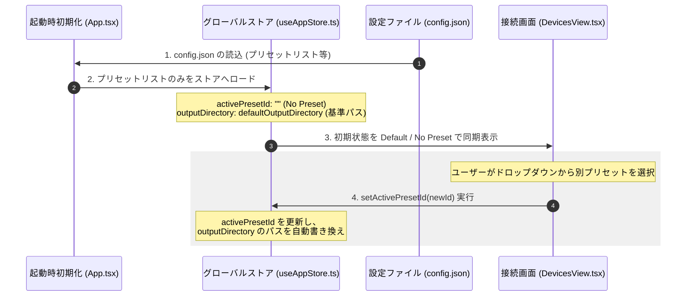

# 15. 出力先プリセット仕様 (Output Presets Design)

本ドキュメントでは、複数のプロジェクトや測定者でシステムを共有する環境において、出力先フォルダを簡単かつ安全に切り替えるための「出力先プリセット（保存先プロファイル）」機能について定義する。

---

## 15.1 設計ポリシー

1. **人物への非依存（汎用性）**
   特定の「ユーザー名」や「ログイン」といった概念をシステムに固定せず、あくまで自由に入力可能な「プリセット名（ラベル）」と「フォルダパス」のペアとして管理する。これにより、個人ごとのフォルダ分けだけでなく、「プロジェクト別」「実験目的別」「日付・期間別」の保存先切り替えにもそのまま柔軟に対応できる設計とする。
2. **ハードウェア設定との分離（共通設定の維持）**
   カメラの露出やステージ速度といった物理的パラメータは、実験の再現性を担保するため、メンバー全員で1つの共通設定（`config.json`の共通キー）を共有する。プリセットで切り替わるのは「出力先フォルダパス（`outputDirectory`）」および「測定メタデータに記録する表示名」のみとする。
3. **ローコード＆低結合なグローバル状態管理**
   DevicesViewでの選択変更時に、グローバルストア（Zustand）が保持する既存の `outputDirectory` ステートを裏で自動的に書き換える。これにより、自動測定ビュー（AutoView）や保存ダイアログの既存処理には一切手を加える必要がなく、影響範囲を接続画面と設定画面のみに限定する。

---

## 15.2 データ構造 (config.json)

`AppConfig/config.json` において、プリセット配列および現在選択されているプリセットを指示するIDを定義する。

```json
{
  "outputPresets": [
    {
      "id": "preset_1",
      "name": "佐藤個人用 (User A)",
      "path": "/Users/shared/NanoPol/Sato"
    },
    {
      "id": "preset_2",
      "name": "金ナノ粒子プロジェクト",
      "path": "/Users/shared/NanoPol/Project_Gold"
    }
  ],
  "activePresetId": "preset_1"
}
```

*   **`outputPresets`**: プリセットオブジェクトのリスト（配列）。
    *   `id`: プリセットを一意に識別する内部ID（重複を防ぐためUUID等で自動生成）。
    *   `name`: UI上に表示される分かりやすい識別名。ユーザー自身で任意の文字列を設定可能。
    *   `path`: 絶対パス。Tauriのネイティブディレクトリ選択ダイアログから取得。
*   **`activePresetId`**: 現在選択（有効化）されているプリセットの `id`。
    *   空文字列 `""`（未指定）の場合は、自動プレ選択は動作せず、手動での出力先フォルダ参照（Browse）が標準となる。

---

## 15.3 画面UI仕様

### 15.3.1 接続画面 (DevicesView.tsx)
アプリ起動時、接続（Connect）操作を行う手前にて、本日の測定プロファイルを選択するUIを提供する。

*   **配置**:
    接続画面（`DevicesView`）の最上部、デバイス接続カードのすぐ上。
*   **コンポーネント**:
    プロファイル選択ドロップダウン（`Select`）および適用パス表示ボックス（静的テキスト・編集不可）。
*   **挙動**:
    *   **※安全設計**: `[Browse]` ボタンなどの物理フォルダパス直接編集操作は、画面責任の混同を避けるため接続画面には配置せず、`SettingsView` に一元化します。
    *   起動時、`config.json` から読み込まれたパスを元に、自動で対応するプリセットが逆引きプレ選択されます。
    *   ドロップダウンを変更すると、Zustandストア内の `activePresetId` が更新され、同時に全体の `outputDirectory` がそのプリセットの `path` に自動で書き換わり、下段のパス表示領域（テキスト）に反映されます。
    *   プリセットが「未選択（`Default / No Preset`）」の時は、`outputDirectory` はシステム既定の基準デフォルト保存先フォルダパス（OSドキュメント下のNanoPol）に自動で戻ります。
    *   設定画面で手動でプリセット外のパスを指定した場合は、接続画面のドロップダウンは自動的に `Custom (Manual)` に切り替わります。
    *   **※警告バッジ表示**: プリセットが「未選択（`Default / No Preset`）」になっている間は、測定者による選択漏れを防ぐため、パス表示の横に `AlertCircle` アイコン付きの「No Profile Selected (Saved to default shared folder)」という注意喚起の警告バッジ（マイルドな警告色）を常時表示します。

### 15.3.2 設定画面 (SettingsView.tsx)
プリセット項目のマスター編集（追加・削除・編集）および、プリセットを使用しない運用のためのパスの直接編集（Browseボタン付き）を一元管理する機能を提供する。

*   **配置**:
    設定画面（`SettingsView`）の「File & Storage (ファイル設定)」カテゴリ内。
*   **機能**:
    1.  **現在適用されている出力パス (Output Directory) の直接編集**:
        最上部に従来通り、出力先入力欄と `[Browse]` ボタンを維持します。これは現在有効な `outputDirectory` にバインドされており、プリセットと連動して動的に表示が変わります。また、ここを直接編集して一時的なカスタムパスを指定することも可能です。
    2.  **プリセットリストの表示・編集 (`useFieldArray`)**:
        登録されているプリセットの一覧をフォームテーブルで表示します。「Add Profile」ボタンで新規行が追加され、名前入力と `[Browse]` ボタンから物理パスを指定します。
        ※**お節介補完の無効化**: プリセット名入力欄では、OSやブラウザが勝手に先頭を大文字化したり、意図しない入力補完を行うのを防ぐため、`autoCapitalize="none"`, `autoCorrect="off"`, `spellCheck={false}` などの自動制御無効化属性を設定します。
    3.  **プリセットの削除**:
        各プロファイル行の「Delete (削除)」ボタンで削除します。現在選択中のアクティブなプリセットを削除した場合は、メモリ整合性を維持するため、アクティブID（`activePresetId`）を空にし、かつ有効な出力パス（`outputDirectory`）も自動的にシステム基準デフォルトパス（`defaultOutputDirectory`）へ即座に書き戻し（連動フォールバック）します。
    4.  **保存時の状態同期**:
        「Save Settings」押下時に `config.json` へ保存され、同時にZustandストアへも配列や有効パス（逆引き含む）が最新状態に再同期されます。

### 15.3.3 起動時の自動クリーンと復元選択仕様（データ混入防止ポリシー）
複数人共有の実験室における測定データの誤混入（他のフォルダへの誤保存）を確実に防止するため、アプリ起動時の挙動を設定画面で選択できる以下の仕様を定義します。
*   **起動時復元トグル（`rememberLastProfile`）の導入**:
    *   **OFF（無効・推奨デフォルト）**: 共有環境向け安全仕様。前回のアプリ終了時のプロファイル選択状態に関わらず、起動時は常に強制的に `Default / No Preset`（システム既定の基準デフォルト保存先）へリセットして開始し、測定のたびに明示的な選択を誘導します。
    *   **ON（有効）**: 1人占有環境向け仕様。前回セッション終了時のプロファイル選択および有効な出力フォルダパスをそのまま自動復元して起動します。

---

## 15.4 状態遷移と初期化フロー


