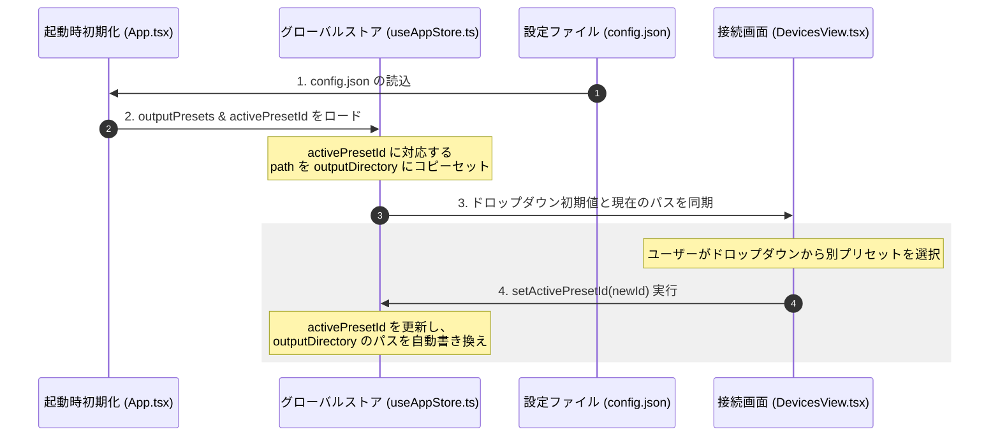

# 15. 出力先プリセット仕様 (Output Presets Design)

本ドキュメントでは、複数のプロジェクトや測定者でシステムを共有する環境において、出力先フォルダを簡単かつ安全に切り替えるための「出力先プリセット（保存先プロファイル）」機能について定義する。

---

## 15.1 設計ポリシー

1. **人物への非依存（汎用性）**
   特定の「ユーザー名」や「ログイン」といった概念をシステムに固定せず、あくまで自由に入力可能な「プリセット名（ラベル）」と「フォルダパス」のペアとして管理する。これにより、個人ごとのフォルダ分けだけでなく、「プロジェクト別」「実験目的別」「日付・期間別」の保存先切り替えにもそのまま柔軟に対応できる設計とする。
2. **ハードウェア設定との分離（共通設定の維持）**
   カメラの露出やステージ速度といった物理的パラメータは、実験の再現性を担保するため、メンバー全員で1つの共通設定（`config.json`の共通キー）を共有する。プリセットで切り替わるのは「出力先フォルダパス（`outputDirectory`）」および「測定メタデータに記録する表示名」のみとする。
3. **ローコード＆低結合なグローバル状態管理**
   DevicesViewでの選択変更時に、グローバルストア（Zustand）が保持する既存の `outputDirectory` ステートを裏で自動的に書き換える。これにより、自動測定ビュー（AutoView）や保存ダイアログの既存処理には一切手を加える必要がなく、影響範囲を接続画面と設定画面のみに限定する。

---

## 15.2 データ構造 (config.json)

`AppConfig/config.json` において、プリセット配列および現在選択されているプリセットを指示するIDを定義する。

```json
{
  "outputPresets": [
    {
      "id": "preset_1",
      "name": "佐藤個人用 (User A)",
      "path": "/Users/shared/NanoPol/Sato"
    },
    {
      "id": "preset_2",
      "name": "金ナノ粒子プロジェクト",
      "path": "/Users/shared/NanoPol/Project_Gold"
    }
  ],
  "activePresetId": "preset_1"
}
```

*   **`outputPresets`**: プリセットオブジェクトのリスト（配列）。
    *   `id`: プリセットを一意に識別する内部ID（重複を防ぐためUUID等で自動生成）。
    *   `name`: UI上に表示される分かりやすい識別名。ユーザー自身で任意の文字列を設定可能。
    *   `path`: 絶対パス。Tauriのネイティブディレクトリ選択ダイアログから取得。
*   **`activePresetId`**: 現在選択（有効化）されているプリセットの `id`。
    *   空文字列 `""`（未指定）の場合は、自動プレ選択は動作せず、手動での出力先フォルダ参照（Browse）が標準となる。

---

## 15.3 画面UI仕様

### 15.3.1 接続画面 (DevicesView.tsx)
アプリ起動時、接続（Connect）操作を行う手前にて、本日の測定プロファイルを選択するUIを提供する。

*   **配置**:
    接続画面（`DevicesView`）の最上部、またはデバイスの接続ステータスカードのすぐ上の領域。
*   **コンポーネント**:
    ドロップダウンセレクトボックス（`Select` / `SelectItem`）。
*   **挙動**:
    *   起動時、`config.json` から読み込まれた `activePresetId` が自動でプレ選択される（未設定時は空欄となり、プレースホルダーが表示される）。
    *   ドロップダウンを変更すると、グローバルストア内の `activePresetId` が更新され、同時に全体の `outputDirectory` がそのプリセットの `path` に自動で書き換わる。

### 15.3.2 設定画面 (SettingsView.tsx)
プリセット項目のマスター編集（追加・削除・編集）を行う管理機能を提供する。

*   **配置**:
    設定画面（`SettingsView`）の「File & Storage (ファイル設定)」カテゴリ内。
*   **機能**:
    1.  **プリセットリストの表示**:
        登録されているプリセットの一覧を表形式（テーブル）またはリストで表示。
    2.  **プリセットの新規追加**:
        「Add Profile Preset」ボタンを押すと、入力フォームが追加され、名前（ラベル名）と、フォルダ参照ボタン（ネイティブディレクトリダイアログ）からパスを指定できる。
    3.  **プリセットの削除**:
        リスト内の各行に「Delete (削除)」ボタンを配置。現在アクティブなプリセットを削除した場合は、自動的に共有デフォルトパス（未設定）へと安全にフォールバックさせる。

---

## 15.4 状態遷移と初期化フロー


